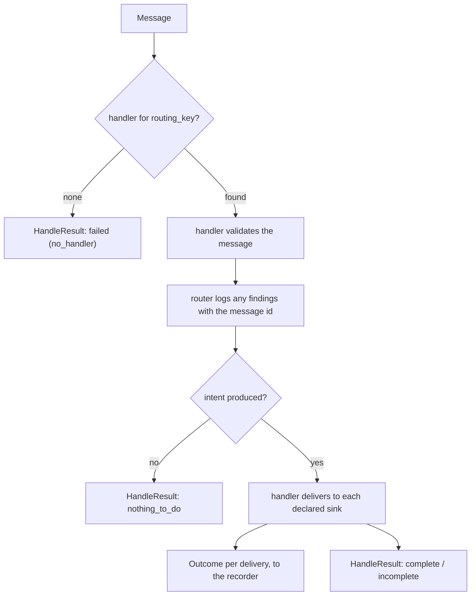

# Dispatcher design

The `dispatching/` package is a small, reusable layer that turns one message into a set of
deliveries and one verdict about them. It defines the contracts a handler must satisfy and the
router that picks the right handler for a message. Concrete messages, handlers, and sinks are
built in a separate layer that depends on this one — never the other way around.

Two grains run through everything below. A **delivery** is one sink call, and its verdict is an
`Outcome` recorded on its own. A **message** gets one `HandleResult`, which says how far its
fan-out got rather than whether the deliveries succeeded.

## Contents

- [Components](#components)
- [Routing](#routing)
- [Error isolation](#error-isolation)
- [Storable detail](#storable-detail)

## Components

The contract is a routing Protocol, five data shapes, and three abstract classes.

| Contract | Role |
| --- | --- |
| **`DispatchableMessage`** | Structural shape the router needs from any message: a `routing_key` to route on and a `message_id` to correlate logs and records. Any object exposing those two attributes satisfies it, so this layer never depends on a concrete message type. |
| **`Handler`** | Per-kind contract, generic over its message type and its own intent type. Two jobs: validate a message into a typed *intent*, then deliver that intent to each sink it declares. Validation stays pure — it returns findings instead of logging, so the router logs them with the message id. |
| **`Sink`** | An output port a handler delivers through. Consumes the already-validated intent (never the raw message) and runs one synchronous side effect. A handler holds one per sink key it can deliver to. Nothing above a sink bounds how long its call takes, so a sink sets that bound inside the client it calls. |
| **`ParseResult` / `ParseIssue`** | What validation returns: the typed intent (or nothing when nothing is actionable), any findings, and any sink keys the message declared that this build cannot deliver. A finding records whether it dropped the whole intent or merely flagged a kept-but-degraded message. |
| **`Outcome`** | The verdict of one delivery: status `success`, `fail`, or `ignore`, plus a detail. One per sink call. |
| **`OutcomeRecorder`** | The port a handler records each delivery's `Outcome` through, keyed by sink key. Abstract here and implemented by the caller that owns the records, so this layer stays storage-free. A delivery is recorded as its sink returns, and `is_done` reads those records so a message handled twice does not deliver twice. |
| **`HandleResult`** | What handling one message produced: a `HandleStatus`, the sink keys nothing could deliver, and a detail the caller records. The caller writes that detail to a JSON column, so it must be storable there — see [Storable detail](#storable-detail). |

## Routing

Handlers are supplied to the router at construction; there is no global registry. The
router builds a table keyed by each handler's `routing_key` and looks up the handler for a
message in constant time. Two handlers claiming the same key is a wiring mistake and is
rejected when the router is built.



Two cases skip the fan-out entirely: no handler is registered for the message's routing key,
which is a wiring gap and reports `failed`, and validation producing no intent, which reports
`nothing_to_do`. Both reach a verdict, so the message is not revisited.

## Error isolation

Every message reaches exactly one `HandleStatus`, and every status is terminal — there is no
retry at either grain. One failure is the exception, and it is described at the end of this
section: a recorder that cannot write.

| `HandleStatus` | When it happens | Retry? |
| --- | --- | --- |
| `complete` | Every sink the intent declared was reached. A sink that reported `fail` lands here too: it ran, and its verdict is on that delivery's own record. | — |
| `nothing_to_do` | Validation produced no intent, so there was nothing to deliver. | No |
| `incomplete` | A declared sink key reached no implementation — either nothing is wired for it, or the message names a sink this build does not know — so one delivery was never attempted. The sinks that were reached still delivered. | No |
| `failed` | No handler is registered for the routing key, or an exception raised while validating or delivering was caught by the router — every exception but `RecorderUnavailable`, which is re-raised instead (below). | No |

The three non-`complete` values all mean somebody has to change something, which is the axis
this status sorts on. A delivery that merely failed is not one of them.

One bad message can therefore neither retry forever nor crash the caller that drives the
router.

### The one failure the router has no verdict for

`RecorderUnavailable` is not converted. A handler raises it — through its recorder — when a
delivery's side effect happened and the record of it could not be written, for a reason a later
attempt may not hit. That says nothing about the message: it parsed, the sink ran, and the only
thing that went wrong was the write meant to remember it.

Mapping it to `failed` would let the caller close a message whose ledger is missing a delivery
already made, and nothing else would ever look at it again. So the router logs it and re-raises,
and the caller — which owns the claim — leaves the message unsettled for another attempt.

```
sink ran ✅ → record fails 💥 → RecorderUnavailable
                              → router re-raises (no verdict)
                              → caller writes nothing, keeps its claim
                              → the message is delivered again later
```

Two consequences worth stating. The delivery may be **attempted twice**, so a sink whose side
effect is more than a log line has to be idempotent — `Sink.emit`'s contract says so. And a
recorder raises this only for a failure a retry could plausibly clear: a write the database
would reject identically every time stays the router's `failed`, because retrying it would
repeat the side effect for as long as the failure lasts.

## Storable detail

The caller records a detail and commits it, so one it cannot write would leave the message
unfinished. Where the caller is a queue drained oldest-first, an unfinished message is picked
again on the next cycle and blocks every newer one behind it. Reaching a verdict therefore
means reaching a *recordable* one.

Both details are typed `dict[str, JsonValue]`, and they are checked at two points:

| Point | Behaviour |
| --- | --- |
| `Outcome` construction | `ensure_storable` raises `ValueError`, so a sink's own tests catch the problem where it was written. |
| The router's return | `safe_detail` swaps an unstorable `HandleResult.detail` for `{"reason": "detail_unstorable", "error": ...}` and logs it. A storable detail is returned as the same object, so the router returns the handler's own result unchanged. |

The check encodes the detail and reads it back. That rejects what cannot be encoded at all
(a `datetime`, an arbitrary object), what is not JSON despite the encoder accepting it
(`NaN`, `Infinity`), and what the encoder rewrites on the way out (non-string dict keys,
tuples) — the last group because the column would return something other than what went in.

Replacing rather than only rejecting is what makes the guarantee hold: a raise inside
`handle` is caught by the router, but the router's own return has no such net above it, and
the caller has to be able to record whatever it is handed. Nothing is truncated — the JSON
column imposes no length the caller needs protecting from.
