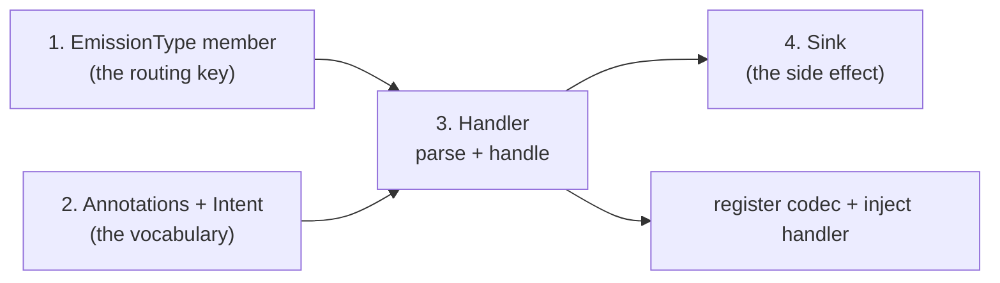

# Adding a new kind of emission

A new kind of emission is a new `emission_type`: a routing key, a handler that owns it, and a
sink the handler acts through. The producer, the consumer loop, and the router are generic over
the type. The handlers under `emissions/handlers/` are worked examples.

### 1. A routing key

Add a member to `EmissionType` in `emissions/db_models.py`. Its value is what the producer writes
to `emission_event.emission_type` and what the dispatcher routes on.

### 2. Annotation keys and an intent

Give the kind its own module under `emissions/handlers/<kind>/`, holding:

- the annotation keys a user sets on a node, built on the shared `PREFIX`;
- an intent dataclass — the validated, typed thing your handler acts on;
- one parser, serving both directions. A serializer stores the same keys the node declared, so
  the parser reads a node's TaskSpec and an event's annotation rows the same way. Each stored
  value is capped at 65,535 UTF-8 bytes, and an intent with any value over that produces no row
  at all — a kind carrying larger values needs a different carrier.

Keep parsing **pure** — return findings as issues rather than logging them, since the caller holds
the node or row id. Set `dropped` deliberately: prefer keeping a usable intent and flagging the
concern. Re-validate on the read side; rows outlive the code that wrote them.

### 3. A handler

Subclass `Handler`, parameterized by the message type and your intent type. Claim your routing
key in `__init__`, take the sinks as a **required** mapping keyed by your sink enum's members
rather than constructing them, and implement `parse` (delegate to the module above) and `handle`.

`handle` loops over the sinks the intent declared, skips the pairs the recorder reports done,
records each `Outcome` as its sink returns, and returns a `HandleResult`: `complete` when every
declared sink was reached, `incomplete` when a declared key had no sink behind it. Let each
sink's verdict stand — recording a failure as a success leaves the log as its only trace — and
report a member missing from your mapping through `record_unresolved` rather than raising, so the
sinks that are wired still deliver.

One delivery may run twice — a crash inside a sink call before its outcome row commits leaves the
pair unrecorded, and another consumer takes the event over once the crashed claim's lease runs
out — so make the side effect idempotent or key it for dedupe, with a key agreed with whatever
receives it.

Nothing retries a failing delivery, so decide what a `fail` costs your kind — a label on a record
that survives anyway, or a side effect that never happened — and say which in the handler's
docstring. A sink gets the intent and nothing else, so anything it needs from the event goes on
the intent first via `dataclasses.replace`; add nothing speculatively, because the sink cannot
tell a synthesized value from a declared one.

### 4. A sink

Subclass `Sink`, parameterized by your intent type, and implement `emit`. It takes the typed
intent and the `execution_node_id`, never raw annotations. The split is deliberate: the intent is
what the annotations said, the id is what they were said about, so a sink needing more of the
node than its annotations carry — an output artifact, a timestamp — reads it from the id, and one
that does not simply ignores it. Report an expected failure as a failing `Outcome` rather than
raising, and log it there; the handler records the verdict without commenting on it.

Nothing above a sink bounds how long its call takes, so bound it inside the client you call — a
request timeout, an RPC deadline — and report the breach as a failing `Outcome`. One synchronous
loop drains the queue, so a call that never returns holds its event's claim until the lease lapses
and every newer row waits behind it.

Add a member for the sink to your handler's sink enum, so a node can declare it. A sink with
nothing to send yet is a legitimate starting point — readiness ships one, reporting `ignore` for
"handled, nothing published".

### Wire it up

Configure the producer before installing its listeners or processing transitions. Each
`EmissionKindRegistration` supplies an `emission_type`, a pure `parser`, a `serializer`
and optional `ignored_parse_codes`. `configure_kinds(registrations=...)` replaces the process's
complete codec list; include `builtin_kinds()` when retaining readiness and quota. The supplied
order is the producer's preparation order and duplicate kinds are refused.

Build the sink and handler, then inject the handler into `DispatcherService(handlers=...)`
and that dispatcher into `ConsumerService(session_factory=..., dispatcher=...)`. A handler's
sink mapping determines which side effects its emitted annotations request. The dispatcher
rejects duplicate routing keys. A missing sink produces an incomplete outcome rather than
silently discarding the request.

## What goes where

| Layer | Holds | Never holds |
|---|---|---|
| `dispatching/` | The `Handler` and `Sink` contracts, the outcome and parse-result types, the router | Anything about emissions: no database models, no annotation keys, no concrete intents |
| `emissions/` | The tables, the producer, the consumer loop, and every concrete handler and sink | — |

The dependency runs one way, `emissions/` → `dispatching/`. Needing to touch `dispatching/` to
add a kind of emission means the contract is missing something.
