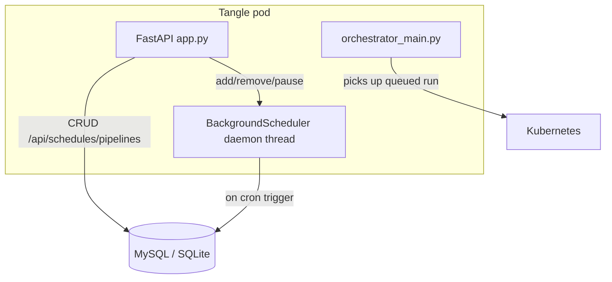

# Native In-Process Pipeline Scheduler

## Summary

**APScheduler 3.x** is the chosen in-process scheduler. Out-of-the-box capabilities:

- **SQLAlchemy job persistence** — scheduled jobs survive process restarts, supports SQLite, MySQL, and PostgreSQL via the existing DB engine
- **Misfire handling** — if the server was down when a job was due, it fires exactly once on recovery instead of duplicating or skipping
- **Concurrency guard** — if a scheduled job is still running when the next trigger arrives, the new run is skipped (no overlapping executions of the same schedule)
- **Pause/resume** — schedules can be paused and resumed without being deleted; all configuration is preserved
- **Zero new infrastructure** — no Redis, no RabbitMQ, no external service

One dependency: `apscheduler>=3.10,<4`. Adds ~100 lines of glue code. DIY alternative would be ~500 lines + tricky edge cases (daylight saving time transitions, misfires, thread safety).

## Architecture



### Workflow

1. User creates a pipeline schedule via `POST /api/schedules/pipelines` (cron + pipeline spec)
2. API writes to `scheduled_pipeline_run` table and registers the job in APScheduler via `add_job()`
3. APScheduler's daemon thread monitors `next_run_time` and fires when due
4. On trigger, APScheduler's daemon thread invokes `execute_pipeline_schedule()`, which:
   - Looks up the schedule from DB, converts `pipeline_task_spec` dict via `TaskSpec.from_json_dict()`
   - Calls `pipeline_runs.create()` with `created_by` from the schedule and annotations: `tangleml.com/source/scheduler`, plus `id` / `name` / `cron` / `updated_at` under `tangleml.com/scheduling/`
   - Always sets `last_run_at` to the current timestamp
   - On success: sets `last_run_submission_result` to `"Success"`
   - On error: sets `last_run_submission_result` to `"Error: <exception message>"`
5. Orchestrator loop detects the new queued run and launches container execution

## Where the Scheduler Runs

Two options considered:

**Option A: In-process (chosen)**

```
FastAPI process
  ├── main thread (uvicorn / API requests)
  ├── BackgroundScheduler
  │     ├── daemon thread (checks next_run_time, fires due jobs)
  │     └── ThreadPoolExecutor (10 workers — runs triggered jobs)
  └── scheduler dies with process (daemon threads auto-killed)
```

**Option B: Separate process**

```
FastAPI process                    Scheduler process
  ├── API writes to DB ──────────→ polls DB for changes every ~10s
  └── no scheduler in-process      └── syncs to APScheduler
```

**Why Option A:**

- **Zero latency** — API calls `add_job()` / `pause_job()` directly in-memory
- **Simpler** — no change detection logic, no sync lag, no second process
- **Fewer failure modes** — no eventual consistency
- **Requires a single scheduler instance** — operators must preserve this constraint when configuring replicas or autoscaling

## DB

Two tables, linked by shared `id`.

**`scheduled_pipeline_run`** — queryable business metadata:

| Column | Type | Notes |
|--------|------|-------|
| `id` | `str` (PK) | 20 hex chars via `generate_unique_id()` |
| `name` | `str` | Human-readable schedule name |
| `cron_expression` | `str` | 5-field or 6-field with seconds |
| `timezone` | `str` | IANA timezone, default `"UTC"` |
| `pipeline_task_spec` | `JSON \| None` | Fully hydrated pipeline YAML as JSON dict. Nullable: the spec may instead come from a linked pipeline run or a saved pipeline reference. |
| `pipeline_task_spec_from_pipeline_run_id` | `str \| None` | FK to `pipeline_run.id`. Placeholder for future use; no writer exists. |
| `pipeline_task_spec_from_user_pipeline_id` | `str \| None` | `pipeline.id` of a referenced saved pipeline. Carries `fk_scheduled_pipeline_run_user_pipeline_id` — see below. |
| `pipeline_task_spec_from_user_pipeline_version_key` | `str \| None` | Pinned `pipeline_version.version_key`, or NULL to follow the pipeline's current version. |
| `schedule_path` | `str \| None` | Caller-facing schedule identity. Permanently nullable; unique per creator when set. |
| `paused` | `bool` | `True` = paused, `False` = active |
| `created_by` | `str` | Original creator (immutable) |
| `created_at` | `datetime` | |
| `updated_at` | `datetime` | Set explicitly by PATCH API only. Not changed when the executor runs (via API trigger or cron). |
| `last_run_at` | `datetime \| None` | Timestamp of the last time the schedule started a run |
| `last_run_submission_result` | `Text \| None` | `sql.Text` (64KB on MySQL, unlimited on PostgreSQL/SQLite). `"Success"` or `"Error: <message>"` |
| `extra_data` | `JSON \| None` | Extensible JSON blob for future metadata |

**Indexes:**

- `ix_scheduled_pipeline_run_updated_at_desc_id_desc` on `(updated_at DESC, id DESC)` for cursor-based pagination. Superseded for the list endpoint by the owner-scoped index below and deliberately not dropped: the migration installs objects and never removes them, and retiring an index is an operator decision taken with an `EXPLAIN`.
- `ix_scheduled_pipeline_run_created_by_updated_at_id` on `(created_by, updated_at, id)` — the access path for the owner-scoped list. Every list read is now `WHERE created_by = ? ORDER BY updated_at DESC, id DESC LIMIT n`, and against a key of `(updated_at, id)` alone that is an ordered scan under a low-selectivity filter: the server walks the whole table newest-first discarding other people's rows, so the `LIMIT` bounds the answer and not the work. Leading with `created_by` makes the equality a range and leaves the sort key ordered inside it, which also serves the cursor's `(updated_at, id) < (…)` and the per-owner `COUNT`. Ascending under a descending `ORDER BY` on purpose: a backward index scan satisfies the exact reverse of a key without a filesort, whereas the MySQL Inspector does not expose key direction to the startup verifier at all — it parses ASC/DESC while reflecting and then returns column names only — so a descending index could not be checked exactly. **It gates nothing** — an absent one costs a scan, not a wrong answer, and refusing the endpoint over it would trade a slow list for no list.

  The evidence is a SQLite `EXPLAIN QUERY PLAN` over the statements the endpoint really emits (`SEARCH … USING INDEX`, no temporary B-tree). SQLite's planner is not MySQL's and no live `EXPLAIN` has been taken, so what is proven is that an index of the right shape exists for the statement, not which key MySQL picks. That sits under the same standing live MySQL coverage gap recorded below.
- `uq_scheduled_pipeline_run_created_by_schedule_path` — unique on `(created_by, schedule_path)`. NULLs are distinct, so it is safe to add before any path exists.
- `ix_scheduled_pipeline_run_user_pipeline_id_version_key` on the two reference columns. The pipeline id leads so "which schedules reference this pipeline" is served by the left prefix, and pinned-version lookups by the whole key, without a second index.

**Source invariant:** `ck_scheduled_pipeline_run_source` asserts that exactly one of `pipeline_task_spec`, `pipeline_task_spec_from_pipeline_run_id` and `pipeline_task_spec_from_user_pipeline_id` is set, and that a version key only accompanies a pipeline id. The **application is the primary enforcement point**: the CHECK is defence in depth, and existing tables may never acquire it, so no code may assume it is present.

**One foreign key, on the saved-pipeline column.** `fk_scheduled_pipeline_run_user_pipeline_id` on `pipeline_task_spec_from_user_pipeline_id → pipeline.id`, `ON DELETE RESTRICT ON UPDATE RESTRICT`.

MySQL permits `ALGORITHM=INPLACE` for an FK add only while `foreign_key_checks` is disabled — which skips the validation the constraint exists for — so a validated add is `ALGORITHM=COPY`, and a copy holds at least `LOCK=SHARED`, blocking the `last_run_at` write every schedule fire performs. A shared lock blocks writes for the duration of the copy, so the decision to install it must account for table size and the operator's availability requirements.

So the trade is a cost decision with an expiry, not a timeless safety property. Startup installs the constraint while the copy is trivial and **declines it above `_MAX_FK_COPY_ROWS`** — 1,000 rows, two orders of magnitude below the index limit, because `ADD INDEX` is `LOCK=NONE` and costs a slow boot when misjudged, whereas this blocks every schedule write. Above the gate the constraint waits for a maintenance window and `reference_writes` stays closed; it does not stall writes to get itself installed. Deferring is not free: the copy only gets more expensive, so "later" is a decision to pay more.

Two read-only preflights run before the statement. The constraint is skipped unless `ix_scheduled_pipeline_run_user_pipeline_id_version_key` exists, because InnoDB otherwise creates its own child index under a name nothing here verifies. And it is **blocked**, not skipped, if any existing row's reference names a pipeline that does not exist — a validated add would fail on it. Nothing is nulled, deleted or remapped to make the add succeed: an orphan is a fact about production, and nulling it is not even available, since the source CHECK requires exactly one source column and a nulled reference leaves a schedule with no source at all.

**No foreign key on the version pair**, and there could not usefully be one: InnoDB implements MATCH SIMPLE, under which a composite key is satisfied whenever any of its columns is NULL — and `pipeline_task_spec_from_user_pipeline_version_key IS NULL` is the ordinary track-current mode, so the constraint would skip the common row while appearing to cover it.

**The constraint does not replace the service layer.** A foreign key proves the parent row exists; pipelines are *soft*-deleted (`deleted_at`), so existence is not liveness, and only the application can refuse a reference to a deleted pipeline. What the constraint adds is atomicity: the service check is check-then-write, and only the engine enforces the reference on every write path — a maintenance task, a `mysql` prompt, a future endpoint that skips the service.

**Hard deletes, re-derived.** Nothing hard-deletes a `pipeline` row today — the only `session.delete` calls in `user_pipelines` are sentinel rows — so `RESTRICT` blocks nothing that currently happens. It does change what a future hard-delete or GC feature has to do: with the constraint in place, deleting a pipeline that a schedule references now fails at the engine rather than silently orphaning the schedule. That is the intended outcome, and it is a *requirement* the P12 design must satisfy rather than a surprise it will hit — the delete path must resolve or refuse dependent schedules explicitly. Note the constraint does not make `RESTRICT` a complete story on its own: a soft-deleted parent still satisfies it.

**Rollback is not an image revert.** DDL is not undone by deploying an older image, so once this constraint exists a previous release runs against a schema that still enforces it. That is safe — the constraint rejects only writes the service layer already rejects — but safe is not reversible. The deliberate reversal is named in code as `rollback_foreign_key_statement`, which returns `ALTER TABLE scheduled_pipeline_run DROP FOREIGN KEY fk_scheduled_pipeline_run_user_pipeline_id` and is **never executed by the application**. Its consequences, in order: the drop is INPLACE and cheap at any size, unlike the add; `reference_writes_ready` goes false on the next boot, closing pipeline-reference writes, which is the tier naming its dependency rather than a regression; `ix_scheduled_pipeline_run_user_pipeline_id_version_key` survives, because this application created it independently rather than letting the constraint create one, so reads keep their index; and startup will attempt the add again on the next boot, so keeping it dropped requires a code change — deliberately, so a constraint cannot leave the schema without a review.

Startup reports, and never drops, any *other* foreign key on the reference columns. On MySQL adding ours does not disturb one. On SQLite it would: the install path rebuilds the table, and SQLAlchemy cannot round-trip an unnamed constraint through reflection, so an unexplained foreign key **blocks** the rebuild rather than being silently destroyed by it.

**What startup does.** Startup adds the mapped columns, the three secondary indexes — the two the write tiers gate on, plus the owner-scoped list's access path, which gates nothing — and the foreign key. No census queries over table data — no COUNT, no GROUP BY — and no attempt to add the source CHECK to an existing table. `ADD INDEX` does scan and sort the table, though: the server does that work rather than a query in the migration, which is why the live row count is a deploy precondition. Readiness is reported per tier (`columns_ready`, `indexes_ready`, `path_writes_ready`, `reference_writes_ready`, `check_ready`) rather than inferred from a clean boot.

Startup index builds require a single scheduler instance and a rollout that keeps the previous instance serving until its replacement is ready. Operators must verify these prerequisites in their replica, autoscaling and rollout configuration. `ALGORITHM=INPLACE, LOCK=NONE` permits concurrent DML for a secondary index add, so the build does not block the per-fire `last_run_at` write.

During a brief rollout overlap, the instance that loses the advisory lock verifies read-only and boots rather than waiting for the build. The advisory lock prevents concurrent migration writes; it does not itself guarantee serving capacity.

**Revisit startup DDL before running multiple scheduler instances or changing rollout availability.**

`INPLACE, LOCK=NONE` stops the build blocking DML but does not make it quick — `ADD INDEX` scans and sorts the table, and its duration scales with table size. Nothing bounds that once the statement is running: the 3-second timeout bounds metadata-lock *acquisition*, and `max_execution_time` applies only to SELECTs. So the bound is taken before emitting anything: startup probes whether the table exceeds `_MAX_INDEX_BUILD_ROWS` with `SELECT /*+ MAX_EXECUTION_TIME(…) */ 1 FROM scheduled_pipeline_run LIMIT 1 OFFSET <limit>` and **declines the build** if it does, or if the probe cannot answer at all. That is one bounded question rather than a measurement: no aggregate, no census, and the execution-time hint is the hard bound on the probe itself. An earlier version read InnoDB's stored estimate from `information_schema.TABLES`; that was wrong, because the value is documented as up to 40–50% off, is recalculated asynchronously, and can be switched off entirely with `innodb_stats_auto_recalc` / `STATS_AUTO_RECALC` — a bound allowed to be stale and allowed to be disabled is not a bound. A declined build is reported, not fatal: the pod boots and the write tier stays closed until someone builds the index deliberately.

The same probe, with the smaller `_MAX_FK_COPY_ROWS` limit, gates the foreign key copy.

Only an **absent** index is subject to the gate. A same-named index with the wrong definition is not waiting on a build — it exists and it is wrong — so it is reported BLOCKED with the exact mismatch rather than skipped as "too big", and an unanswerable probe can never close a tier that is genuinely open.

The refusal names the *limit*, not a size: the probe measures no size, so reporting a count would mean either the aggregate this avoids or the stale statistic it replaced. The threshold and the decision appear in the step detail and startup warning, so a first boot against a large table says why it stopped instead of stalling silently.

Still unobserved: server lock behaviour under concurrent `last_run_at` writes. The tests assert emitted SQL and statement order, not that MySQL honours `LOCK=NONE` in practice — nor that `LOCK=SHARED` behaves as documented during the foreign key copy, nor that a database proxy forwards the `MAX_EXECUTION_TIME` hint rather than stripping it. Operators should verify these properties and measure migration duration against their database and proxy configuration.

The unique index cannot fail on data today because `schedule_path` has no writer, so every value is NULL and InnoDB permits many NULLs in a unique index; installing it before that writer exists is what keeps it true.

Fatality is narrow: only a column that cannot be brought to its exact target definition stops a boot. A failed index build leaves its write tier closed and is retried next boot. The CHECK gates nothing and is reported only, because an existing table may legitimately never acquire it.

**`apscheduler_jobs`** — auto-created by `SQLAlchemyJobStore`, opaque:

| Column | Type | Notes |
|--------|------|-------|
| `id` | `str` (PK) | Same as `scheduled_pipeline_run.id` |
| `next_run_time` | `float` | Next fire time (epoch) |
| `job_state` | `blob` | Pickle blob with trigger + kwargs |

## What a Schedule Executes

A schedule row carries exactly one spec source, and all three stay executable through the migration.

| Source | Column | Resolved at each fire |
| --- | --- | --- |
| Inline | `pipeline_task_spec` | No — the stored dict is the spec |
| Pipeline run | `pipeline_task_spec_from_pipeline_run_id` | Yes — the run's root TaskSpec |
| Saved pipeline | `pipeline_task_spec_from_user_pipeline_id` (+ optional `..._version_key`) | Yes — current or pinned version |

### Precedence

Inline wins whenever it is present, and the choice is made explicitly rather than inferred from the one-source invariant holding. `ck_scheduled_pipeline_run_source` forbids two sources on one row, but this is the fire path: a row that somehow carries both must keep running the spec it ran yesterday rather than silently switch source. A row with *no* source records the same `pipeline_task_spec is None` error it always did.

### Current-following versus pinned

`..._version_key` being NULL is what makes a reference *current-following*; there is no mode column to disagree with the data.

- **Following** resolves through the pipeline's explicit `current_version_key` pointer — not `MAX(created_at)`. Those differ the moment a pipeline is rolled back, and following the wrong one would silently run the wrong spec.
- **Following a `DISABLED`-mode pipeline resolves the mutable `current` head.** Its content can change with no change to the schedule row. That is what following means, and it is worth stating plainly because a schedule whose behaviour changed while the schedule did not looks like a bug to whoever debugs it next.
- **Pinning requires the pipeline to be in `FULL` mode *now*.** Excluding the reserved `current` key is necessary but not sufficient: switching a pipeline to `DISABLED` does **not** delete its historical immutable rows, so a pin would otherwise resolve a version its owner can no longer see or manage through the versioning APIs. The check lives in `user_pipelines.services` (`require_pinnable_versioning`) so the executor and the schedule writer cannot drift into two answers, and it is **not** a caller-side preflight: `create_from_pipeline(require_pinnable_versioning=True)` forwards it into `get_pipeline_and_version`, which reads the pipeline with a **shared** row lock (SQLAlchemy's `read=True`, which this MySQL dialect emits as `LOCK IN SHARE MODE` -- the string to grep for in a slow query log) and checks the mode *inside that locked read, before the version row is selected*. The mode writer (`patch_pipeline_properties`) takes `FOR UPDATE` on the same row, and a shared lock blocks an exclusive one, so the two still serialize -- while two schedules resolving pins against the same pipeline no longer queue behind each other for a row neither of them writes.

  The guarantee is therefore about **selection time, not submission time**. What makes that safe is that a `FULL`-mode pin resolves a digest-keyed row that no supported service path mutates (only the `current` sentinel is mutated in place), so the copied content cannot change afterwards.

  **Who releases the lock is a caller's decision, and it is opt-in.** The service does not roll back on its own: the run is built with `_create_in_transaction`, inside the caller's transaction, so a rollback here would discard whatever the caller had already written — for the trigger path, the fence row claiming the cycle. Left alone, though, the shared lock lives until the caller commits, which for a large graph spans annotation validation, `TaskSpec` parsing, recursive execution and artifact insertion, and the flush. That is wider than it looks: a shared lock blocks every exclusive one, so `set_pipeline` and `delete_pipeline` on that pipeline would queue behind a scheduled fire, not merely a versioning-mode change. `create_from_pipeline(end_lookup_transaction=True)` rolls back once the selected content has been copied out, restoring the narrow window; the executor passes it because its `run_session` is created per submission and provably has nothing pending, and it stays off for everyone else.

  Verification limits, stated rather than assumed: SQLite has no row locks, so the tests exercise **ordering, not locking**. Whether `LOCK IN SHARE MODE` / `FOR UPDATE` behave as documented across the ProxySQL connection layer -- in particular whether a transaction's statements share one backend connection -- is **not yet verified** against the live topology.

### Ownership

Every reference is resolved **as the schedule's `created_by`**, never by id alone. This is load-bearing: `_get_pipeline` treats `user_id` as optional and only filters ownership when it is supplied, so omitting it would let any schedule execute any user's saved pipeline. Run references compare `PipelineRun.created_by` explicitly, and refuse a run with no owner recorded rather than letting a NULL comparison decide an authorization question.

Refusals are reported as *not found* rather than *forbidden*: telling a schedule owner that an id exists but belongs to someone else is itself a disclosure.

### Error semantics

Resolution failures are recorded per fire and never raised: the executor writes `last_run_at` and `last_run_submission_result` on the schedule row and returns. Missing, soft-deleted, unauthorized and unpinnable references all take this path, as does a pipeline with no current version.

This matters because a reference to an unusable pipeline or run is genuinely reachable, and it has to degrade to a failed fire rather than a crash that leaves APScheduler holding a job whose failure was never recorded.

Note that the database constrains less than it appears to. Both reference columns now carry a foreign key — the run column always did, and the saved-pipeline column's was restored in the scheduler schema work after being dropped earlier — but **a foreign key proves existence, not usability**, and three cases slip past it:

- **Soft deletion.** Deleting a saved pipeline sets `deleted_at`; the row stays, so the constraint is satisfied while the reference is dead to every reader that filters on liveness. This is the ordinary case, not an edge one.
- **A constraint that never installed.** The saved-pipeline foreign key is added at boot only after an orphan preflight passes. On a database where orphans already existed it is reported blocked and no `ADD` is emitted, so that one column stays unconstrained and its existing dangling rows persist. Scoped deliberately: the run column's foreign key and every other constraint on the table are unaffected.
- **Everything else the resolver checks** — ownership, version existence, pinnability — none of which a single-column foreign key can express.

So the service layer remains the authority on whether a reference is usable, and the executor's per-fire error path is load-bearing rather than defensive decoration.

### Sessions

Submission always uses the executor's `run_session`, never `schedule_session`. The saved-pipeline path asks for `end_lookup_transaction=True`, and a run-reference read is followed by an explicit `rollback()` — the latter because `PipelineRunsApiService_Sql.create` opens its own transaction with `session.begin()`, which raises if one is already active. (`create_from_pipeline` no longer needs that: it builds the run with `_create_in_transaction` and has no nested `begin()` to make room for.) Either rollback would discard the pending `last_run_at` write if it landed on `schedule_session`, which is why neither does.

### Provenance

A scheduled saved-pipeline run carries **both** source annotations: `tangleml.com/source/scheduler` from the executor, and `tangleml.com/source/user-pipeline` forced by `create_from_pipeline` alongside the pipeline id, version digest, owner and file path. Both are true, and the canonical saved-pipeline provenance is written by the service rather than reconstructed here.

## Schedule Paths and Reference Writers

### `schedule_path`

A stable, user-owned alternate identity for a schedule: unique per `created_by`, set once, and
addressed as a **collection query parameter** (`?schedule_path=...`) rather than a path segment. It
cannot be a path segment: a path may contain `/`, so it would be ambiguous against the `{id}` routes.

**`schedule_path` is optional in the request, but every stored row has one.** Omitting it (or sending
an explicit `null`) means *derive one*, not *store null*. So the API stays backward compatible for
every existing caller, while the set of rows needing the reconciliation backfill stops growing. The
column itself stays permanently nullable, because rows predating this work are legal forever.

An **explicitly supplied** value goes through the strict canonical normalizer and is never repaired:
`""` or `"   "` is a `422`, not a silent fall back to derivation. A caller that sent the field meant to
choose the identity, and quietly substituting a different one would be worse than refusing.

### Deriving a path

`schedule_paths.generate_legacy_schedule_path` produces `schedules/<ascii-slug(name)>-<schedule_id>`.
The same generator is used by the PR4 backfill, so derived and backfilled rows land on identical
shapes.

Derivation is **lenient** where canonicalization is **strict**, and they are separate functions on
purpose. Names already exist and cannot be rejected, so every name must yield something usable:
NFKD-folding degrades accented Latin to its ASCII skeleton (`Ünïcode` → `unicode`), text with no ASCII
skeleton at all (CJK) reduces to the fallback slug `schedule`, and runs of disallowed characters
collapse to `-`. The derived value is then passed through the strict normalizer, so both paths converge
on one guarantee about the stored bytes. Merging the two would break something either way: repairing
explicit input would store what the caller did not ask for, and rejecting derived input would make
omission impossible.

The **opaque schedule id is always included and never truncated**. Names are neither unique nor
immutable — two schedules may share a name, and a name may be edited afterwards — so deriving from the
name alone would either collide on the per-owner unique index or leave a path that stops describing its
schedule. The id makes every derived path unique by construction, so a derived create cannot lose a
uniqueness race. Only the slug is truncated under the 255-character cap; if the id alone cannot fit,
derivation raises rather than shortening it, because trading away uniqueness silently — and only for
the longest ids — is the worst available outcome.

The id is normally an insert default that does not exist until the `INSERT`, so it is generated
explicitly and assigned before `session.add`, which suppresses the default and keeps this to a **single
insert** with the path already present. Obtaining it via `flush()` is specifically avoided: flush holds
an uncommitted write lock, which deadlocks against APScheduler's separate connection on SQLite (the
hazard the create path already documents). Making the model's `id` an `init=True` field was also
rejected — that changes the model contract for every caller to serve this one derivation.

The consequence is worth stating plainly, because it is larger than a feature gate: since every
successful create stores a path, **every create depends on the path tier**, including a plain inline
create that sends no path and names no saved pipeline. On a process that booted before the unique index
was in place, schedule creation stops entirely rather than degrading to path-less creates. That is
acceptable only because the rollout order puts the index migration strictly ahead of this code; it is
asserted by `test_every_create_is_gated_including_plain_inline` and
`test_a_derived_create_is_still_gated_by_the_path_tier` so the blast radius is visible to whoever
changes the gate next. The one write that still succeeds under a closed path tier is an id-addressed
PATCH that touches no new column — which is how an operator pauses a misbehaving legacy schedule
mid-migration.

### Addressing by path

`PATCH`, `DELETE` and `POST .../trigger` accept `?schedule_path=`, alongside the pre-existing
id-addressed routes, which are unchanged. Both modes run through one shared handler per verb
(`_apply_update` / `_apply_delete` / `_apply_trigger`) with a single caller-scoped lookup, so the two
cannot drift into different validation, status codes, or scheduler side effects. Resolution happens at
the API boundary: the executor and the scheduler service are still called by id and need no path
awareness.

The `DELETE` and `PATCH` path routes sit on the collection URL, so the `schedule_path` query parameter
is **required** — without it, a `DELETE` on a collection would read as "delete everything". The
by-path trigger is `POST .../trigger`, a fixed collection segment, which does not collide with
`POST .../{id}/trigger` because the two differ in depth. An earlier review flagged `trigger` as a
literal/dynamic collision risk; that does not apply to these shapes, since there is no dynamic `POST`
at that depth. The literal is registered first regardless, so the ordering stops mattering if a
`POST .../{id}` is ever added.

A path-addressed `PATCH` **cannot repath**, including to the same value: the path is the address, so
honouring a change would rewrite the identity the request was routed by. Adoption is available on the
id-addressed PATCH only. Point side effects addressed by path require the path tier, since they rely on
the unique index; the same edit addressed by id does not.

Every write and every lookup goes through one normalizer (`schedule_paths.canonicalize_schedule_path`).
That is load-bearing rather than tidy: writes and reads must agree on what a path *is*, and the only way
to guarantee that is for both to pass through the same function.

**Case is part of the identity, and is preserved.** `Foo/Bar` and `foo/bar` are two different paths.
Both may exist under one owner, each resolves only to itself, and neither can be reached by asking for
the other. An earlier revision folded input to lowercase, which made them one identity.

Case preservation is not a string-handling change on its own — it is only honest if the database agrees.
So it is enforced in three places that must be changed together:

- **The normalizer** does not fold. Segments match `[A-Za-z0-9][A-Za-z0-9._-]*`.
- **The column** carries an explicit case-sensitive collation on MySQL
  (`db_models.SCHEDULE_PATH_COLLATION`, on `schedule_path` and on nothing else), so `=` and the path
  half of the unique index over `(created_by, schedule_path)` compare case-sensitively. Without it,
  MySQL's default folds case and the API would accept `Foo/Bar` and then either refuse it as a
  duplicate of `foo/bar` or answer a lookup for one with the other. The column as mapped on SQLite
  takes its default collation, which compares `TEXT` byte-for-byte, so the two backends agree.
  (SQLite *does* have collations — `NOCASE` folds ASCII case, and the tests use it deliberately to
  build a folding column — so the agreement is a property of the column as declared, not of the
  engine.)
- **Startup** verifies the *live* column, because a database that reached its current shape by upgrade
  can have a case-folding column that no reflection reports. See "Collation is verified, not assumed".

The exact order is **trim → reject non-ASCII → validate structure**. Trimming is the only repair
performed; surrounding whitespace is transport noise, everything else is either accepted as sent or
rejected. Non-ASCII is rejected ahead of structural validation so that a non-ASCII value is always
reported as non-ASCII rather than as a bad segment.

Rejecting non-ASCII no longer has to retire a case question, but it is still load-bearing: it keeps
accent folding, Unicode normalization forms and width variants out of an identity that must compare
byte-for-byte on two backends. It also removed a sequencing hazard that only existed because of the
fold — a few non-ASCII characters lowercase *into* ASCII (U+212A KELVIN SIGN becomes `k`), so the ASCII
check had to run first or the character was silently rewritten.

Because a segment must start with a letter or digit, `.` and `..` are structurally impossible:
traversal is rejected by the charset rule, not by a special case. Embedded dots stay legal, so `v1.2`
is a valid segment.

**Derived paths remain lowercase**, and that is not an inconsistency. A derived path is not an identity
the caller chose, so there is no case to preserve; `schedules/<slug>-<id>` keeps one predictable shape,
and the id suffix is what makes it unique. The result still passes the strict normalizer.

### Collation is verified, not assumed

`create_all` gives a fresh MySQL database the right collation, so the only way to be wrong is by
**upgrade**: a `schedule_path` column that already exists and inherits a case-folding table default.
Reflection does not expose collation at all, and `SHOW CREATE TABLE` prints `COLLATE` on a column only
when it overrides its table — so an inherited folding collation is invisible in the DDL and to every
reflected check. It is read from `information_schema.COLUMNS`, which reports the value MySQL actually
resolved, and carried on `LiveShape` so the single verification path covers it and the pod that only
*verifies* the schema reaches the same verdict as the pod that installs it.

**The path column only, and the unique key is deliberately mixed.** An earlier revision of this
section argued the opposite — that `uq_scheduled_pipeline_run_created_by_schedule_path` is as strict
as its loosest column, so converting the path without the owner was "no fix at all for the pair" —
and converted `created_by` to the same binary collation . The reasoning was
internally sound and its premise was wrong: it assumed `jose` and `Jose` are two principals
contending for one `(owner, path)` slot. **They are not. User identity here is not case-sensitive**,
so those spellings are one person, sharing one slot is the intended behaviour, and the "fix" was
excluding people from their own schedules. The owner conversion and every application-side byte-exact
owner residual have been reverted.

So the key is intentionally mixed, and a unique key is as strict as each of its columns *separately*,
which is what makes that coherent rather than half-converted:

| Half | Comparison | Consequence |
| --- | --- | --- |
| `created_by` | the column's inherited collation | `Jose` and `jose` address one owner namespace |
| `schedule_path` | `utf8mb4_0900_bin` | `Foo` and `foo` are two distinct paths *within* that namespace |

Both halves are the product contract. Do not reintroduce the owner conversion in the name of making
the key uniform.

**Owner comparison is the deployment's, and this codebase states no rule of its own.** Nothing in the
request path lowercases, casefolds or Unicode-normalizes an owner name; the equality is a plain SQL
`=` evaluated under whatever collation `created_by` inherits. That is a deliberate refusal to invent
a contract: the only stated product requirement is that identity is not case-sensitive, and going
further — declaring accent behaviour, NFC/NFD equivalence or kana folding — would be asserting
something nobody has decided. The application supplies `UserDetails.name`; the scheduler
uses that principal without imposing an authentication provider or identifier format.

> **Known limitation — comparison semantics depend on database collation.** A MySQL column using
> `utf8mb4_0900_ai_ci` folds case and accents, while the SQLite the unit suite runs against compares
> byte-for-byte. Ownership can therefore differ between a local database and a deployment using a
> folding collation. This is the same shape as the live MySQL coverage gap below: a property checked
> in an environment that does not have it. The sibling `triggers` subsystem lives with the identical asymmetry
> (`triggers/db_models.py`). Tests that need folding behaviour build a `COLLATE NOCASE` column
> explicitly rather than pretending SQLite is MySQL.
>
> The decisive check is read-only and takes one query, but needs a live database:
> `SELECT COLUMN_NAME, CHARACTER_SET_NAME, COLLATION_NAME FROM information_schema.COLUMNS WHERE
> TABLE_SCHEMA = DATABASE() AND TABLE_NAME = 'scheduled_pipeline_run' AND COLUMN_NAME IN
> ('created_by', 'schedule_path')`. Two rows settle both contracts: the owner column's actual
> accent behaviour, and that the path column really is `utf8mb4_0900_bin` — without which a 2xx on a
> case-variant path write proves nothing.

**Why the path column can accept the property rather than a name.** A `schedule_path` is ASCII by
construction and trimmed, so over that repertoire any case-sensitive collation is byte-exact: it has
no accents to fold, no canonical equivalents to collapse and no trailing space for a PAD SPACE
collation to swallow. That is why the check below tests behaviour rather than a blessed spelling.
(The reverted owner conversion could not make that argument, which is exactly why it demanded
`utf8mb4_0900_bin` by name — the reasoning was correct for the premise it had.)

Verification tests the **property**, not a blessed name, because a database
already carrying an equally case-sensitive collation is correct and must not be failed over a
spelling. The name is
**parsed**, and that rule was wrong twice. `endswith(("_bin", "_cs"))` refuses
`utf8mb4_ja_0900_as_cs_ks`, which is accent-, case- and kana-sensitive — fail-closed failing on a
database that was already right. Widening it to token membership was worse: `utf8mb4_cs_0900_ai_ci`
is the **Czech** collation, where `cs` is the locale and the trailing `ai_ci` is the sensitivity. It
folds case, and membership called it strict, which would have opened path writes on a column that
still aliases `Foo` and `foo`. The sensitivity is **terminal** — `_bin`, or `_<accent>_<case>`
optionally followed by `_ks` — and anything else is not recognised as strict. Enumerating all 91
`utf8mb4_*` collations in MySQL 8.0 `strings/ctype-uca.cc` gives four terminal shapes and no others:
56 `_ci`, 33 `_cs`, 1 `_cs_ks`, 1 `_bin`.

Unreadable metadata is a conflict rather than an absence — absence would invite a table-copying
`ALTER` against a column nobody could read. Every target column is read in **one** statement, so a
failed read reports the inspection it was rather than a partial answer, and a column present in the
table but missing from the result is unreadable rather than passing.

**The path is re-compared in the application, and the owner is not.** The path locators once did the
reverse — re-checking the owner and not the path — and the docstring explaining why cited a property
that had expired: the canonical path was "lowercase ASCII by construction" only while the
canonicalizer still folded case. Once paths preserve case, a query for `Team/Nightly` against a
folding column matches the row stored at `team/nightly` — same owner, different schedule — and
nothing downstream noticed. The path residual closes that. The owner residual that briefly sat beside
it is gone: it re-compared owners byte for byte, so on a folding deployment it 404'd callers on their
own schedules.

**That is not reachable through the API at this head**, and an earlier version of this section
claimed it was. Every path-addressed route — PATCH, DELETE, trigger and the path-filtered GET —
calls `_require_schema_tier(SchedulePath)` first, and the collation steps are members of that tier,
so a folding column closes those routes with a 503 before any locator runs. The residual is kept as
defence in depth, and the depth is real rather than nominal: the gate's verdict rests on *parsing a
collation name*, so a name that parses as strict while the server compares loosely — a new
collation, a misread, a future edit to the parser — opens the tier, and then the residual is the only
thing left. It is also what makes the locators correct in isolation, which is how they are unit
tested. What it is not is a live exposure, and describing it as one overstated the case.

The locators project `schedule_path` alongside `created_by`, and
`_reject_unless_exactly_identified` compares the path; the locators cannot decide what a mismatch
means themselves, because only the caller knows which question it asked. `created_by` is still
projected because the id-addressed routes authorize against it and both addressing modes read the
same shape.

The database predicate in those locators is a plain equality on purpose. It keeps the unique index
eligible; the key bounds the result to one row per owner and path, so a path neighbour can be
recognised and refused in Python with no risk the named row was filtered out first.

**The conversion refuses a definition it has not verified.** `MODIFY COLUMN` replaces a definition
rather than adjusting one, so the statement would impose the model's width, nullability and absence
of a default on whatever is live: a wider column truncated, a nullable column tightened (rewriting
existing rows, or failing the copy on the first NULL mid-`ALTER`), a server default dropped under a
previous image still inserting without the column. A drift is BLOCKED before any DDL, not skipped:
no later boot clears it.

**The application keeps its PATH residual regardless.** The column collation is what makes the unique
key exact; the Python path re-comparison is what stays correct on a deployment where the conversion
has not run yet, and there is no moment at which both are guaranteed. Removing it after the migration
would make correctness depend on a DDL nobody in the request path can verify. The owner predicate has
one definition (`schedule_queries.owned_by`) used by both the list endpoint and the 409 classifier:
they need it for different reasons — pagination completeness and conflict evidence — and two copies
would eventually stop matching.

**Both addressing modes now use one comparator.** `_check_ownership`, which the id-addressed routes
use to raise 403, used to compare owners in **Python**, so it folded nothing — while the
path-addressed routes delegate to the database, which folds case on MySQL. Ownership therefore
depended on how the caller addressed the row: a caller whose identity provider hands back a
differently-cased spelling of their own address was served by path and refused by id, with a 403
naming them as a stranger to themselves. The CLI met this as an id-route limitation before it was
recognised as this bug.

It is fixed rather than documented, because "user identity is not case-sensitive" is a product ruling
about the scheduler, not about one family of routes. `_check_ownership` now authorizes with an
owner-scoped SQL probe — `schedule_queries.is_owned_by`, which is
`SELECT 1 WHERE id = :id AND created_by = :caller` under `owned_by`, the same predicate the list
endpoint and the 409 classifier use. Nothing in the request path compares two owner names in Python.

The **404-vs-403 split is preserved deliberately**, and it is why authorization is a second statement
rather than a filter on the first. The id routes resolve the row **unscoped** — so absent stays
distinguishable from foreign — and only then probe for ownership; folding that scope into the initial
read would collapse every 403 into a 404 and change a documented behaviour this correction has no
mandate to change. Admin short-circuits before the probe, so the bypass is unchanged and costs no
extra statement. **Locking is unchanged**: the probe is a plain indexed read taken before
`lock_path_owner` acquires anything, so no lock is held across it and no lock order is introduced.

The cost is one primary-key probe per id-addressed request. That is the price of the comparator
living in exactly one place, and it is the same trade the path routes already make. Path routes still
read once, because scoping and resolving are the same statement for them; that id/path difference in
statement count is real and is the direct consequence of id routes owing a 403.

**The same sweep found one more.** `executor.resolve_owned_run` compared `PipelineRun.created_by` in
Python too, so a schedule owned by `Alice@example.com` could not reference a run the same person had
created as `alice@example.com` — refused at write-time preflight, and refused again at every fire if
the spelling ever diverged. It now uses the same shape (`_run_is_owned_by`), against `PipelineRun`
rather than `ScheduledPipelineRun` because that is the table the reference is authorized against. Its
explicit `created_by is None` branch is kept ahead of the probe: a scoped probe already returns no row
for NULL, but reaching that answer by accident is the hazard the branch exists to name, and the three
refusals are logged apart.

The absence of a Python owner comparison is enforced structurally, not by convention: `_check_ownership`
is asserted by AST to contain no comparison at all, and `resolve_owned_run` to contain no equality —
only the `is None` test. Both are parsed rather than grepped, so the docstrings recounting the removed
rule do not trip them.

A folding column **closes path writes** and nothing else. The service still boots and every non-path
feature still works, but no path write is accepted, because storing an identity the column cannot keep
distinct is worse than refusing it. The conversion is emitted at startup as
`ALGORITHM=COPY, LOCK=SHARED` — a collation change rebuilds the column and every index over it — and is
declined on a table too large to convert during boot, exactly as the foreign-key copy is and behind the
same `_MAX_FK_COPY_ROWS` gate — it is one of *up to two* copying statements this module can emit in
a single boot (the path column, plus the foreign key), not an exception to a one-copy rule. It was
briefly up to three, while `created_by` was also being converted; reverting that premise is what
returns the expected staging boot to a single collation copy. It cannot
fail on data: moving a unique index from a case-insensitive to a case-sensitive collation only makes
comparison stricter, so two rows distinct before stay distinct, and two that would now collide could
never both have existed. The reverse direction is the dangerous one, and is not what this does.

**Set once.** Adoption (`NULL` → path) is allowed through PATCH so rows predating paths can acquire
one; re-sending the same canonical value is a no-op so a client can replay a PATCH; changing an
existing path is refused with 422. A path is an identity, so rewriting it would silently break every
caller addressing the schedule by the old value. A genuine `(created_by, schedule_path)` collision is
409 — a real conflict with existing state, unlike a closed schema tier.

**A path collision does not always arrive as a duplicate-key error.** The unique index is contended by
design — two writers racing for one path is exactly what it settles — and the assumption that
contention always surfaces as an `IntegrityError` is wrong. InnoDB's duplicate check takes a shared
lock on the conflicting index record, so a writer that finds the key uncommitted waits, and that wait
can end as a deadlock (1213) or a lock-wait timeout (1205). Both are `OperationalError`, so before this
was handled they escaped the classifier and a taken path became a 500. `triggers/service.py` documents
the same shape on its own unique insert.

A lock failure is classified by the **same proof** a duplicate-key error is, and deliberately not by
driver error codes:

- **The path is now taken → 409.** Once another schedule owns it, that is the true and final answer
  whatever lock sequence produced the failure, and the caller must not be told to retry something that
  can only fail again. The path is only offered as proof when the request actually tried to claim one:
  a PATCH that adopted nothing would otherwise match its *own* row and receive a permanent 409 for a
  transient failure.
- **Otherwise 503 with `Retry-After` → not 500.** No row was written, the request is safe to repeat
  verbatim, and a deadlock victim clears the moment the winner commits. It carries a **positive** code,
  `schedule_path_lock_contention`, rather than being identifiable by the absence of one: an
  infrastructure 503 (a proxy, a load balancer, a pod shut down mid-request) is also uncoded and
  carries the *opposite* guarantee, so a client classifying on absence would apply "nothing was
  written" to responses this service never issued. `Retry-After` does not separate them either;
  proxies emit it too.

**Only 1205 and 1213 are reinterpreted, decided by the driver errno rather than the exception class.**
Those two are the ones guaranteed to have left nothing written, which is the entire basis for telling
the caller to repeat the request. Every other `OperationalError` — a dropped connection, an exhausted
pool — escapes as a 500, because such a failure can occur with the write already applied and only the
response lost. A 500 honestly reports an unknown outcome; a retry-safe 503 would be a promise the
server cannot make, and a caller repeating that write would meet a 409 on its own path and conclude
somebody else had taken it. An unrecognisable driver shape (no integer errno) is likewise not
reinterpreted — the cost of missing a real deadlock is one 500 on a request the client would have
retried anyway.

The reference-existence check is never consulted for a lock failure — a lock says nothing about whether
a parent row exists, and a 404 would send the caller to fix something that was fine. There is no
in-process retry: the client can resubmit far more cheaply than a request thread can be held through a
backoff, and holding one is how a contended path becomes an exhausted connection pool.

**Owner scoping is mandatory on the path filter and only there.** A path is unique *per owner*, so an
unscoped path match could return another user's row, or several. Admin is deliberately not a
cross-user path resolver: a path names at most one row per owner, so resolving one globally would be
ambiguous rather than powerful. A filter miss is `200` with an empty collection and `total_count: 0`,
not 404 — it is a filter, not a point lookup. The filtered `total_count` reflects the filter, because a
filtered response whose total counted the whole table would actively mislead.

**Every read is owner-scoped, and this reverses what an earlier version of this section said.** The
unfiltered list used to return every user's schedules, and `GET /{id}` used to return any schedule
whose id a caller knew — spec included — while `PATCH`, `DELETE` and the trigger on that same id
returned 403. Review called that out: the API answered "may I see this?" differently depending on how
the request was spelled. It is resolved by scoping the reads, not by widening the writes.

The two reads are scoped by different mechanisms, and the difference is not cosmetic:

| read | mechanism | admin |
| --- | --- | --- |
| `GET /{id}` | unscoped resolve, then `_check_ownership` → `is_owned_by` SQL probe | bypasses, as on every id route |
| `GET` (unfiltered) | SQL predicate, `_owned_by_caller` → `owned_by` | **does not** bypass — sees only their own |
| `GET ?schedule_path=` | the same SQL predicate, plus the exact Python re-check on the **path** | not a cross-user path resolver |

All three rows compare the owner in **SQL**, under the deployment's own collation, and that is the
whole ownership contract. Nothing in the request path compares two owner names in Python. The
mechanisms differ only in what question each read has to answer:

- the list scopes its `SELECT`, because `LIMIT` is applied by the database before any Python could
  run — a post-filter would silently shorten pages. `total_count` is counted under the same predicate,
  so a caller is not told how many schedules exist that they cannot see.
- the id read resolves **unscoped** and authorizes with a second statement
  (`SELECT 1 WHERE id = :id AND created_by = :caller`), because it must distinguish absent (404) from
  foreign (403) and a scoped read cannot. One helper covers every verb on an id, so the answer cannot
  depend on which one is used.

**The list predicate is a plain equality, and its absence of a residual is the contract.** It was
briefly `CAST(CAST(created_by AS CHAR CHARACTER SET utf8mb4) AS BINARY)` on both sides, to stop a
folding collation matching `Jose` for `jose`. That is withdrawn: those are one person, so the residual
was removing callers' own rows from their own lists on precisely the deployments it was written for.
It was also unindexable, forfeiting the leading `created_by` column of
`ix_scheduled_pipeline_run_created_by_updated_at_id` — which serves the equality *and* the `ORDER BY`
together, so the plan that satisfies the sort is the one that skips other owners' rows.

The rejected shapes are recorded because each looks correct and will be re-derived otherwise, and
because the reason they are gone is now the *premise*, not the mechanics: `COLLATE utf8mb4_bin` is
only legal when the column's charset already is utf8mb4 — which nothing here pins — and it is PAD
SPACE, so it would call `'jose '` and `'jose'` the same owner. A bare `CAST(... AS BINARY)` compares
each side's *current* bytes, so a latin1 column read over a utf8mb4 connection makes `josé` `E9` in
the column and `C3 A9` in the parameter. The double cast fixed both and was still wrong, because no
spelling of "byte-exact" is the right answer to a question whose answer is "do not compare this
yourself".

The absence is pinned rather than left to be noticed: `owned_by` takes **no `Session`**, so it is
structurally unable to branch on dialect, and compiled-SQL tests assert that no `CAST`, `COLLATE`,
`CHARACTER SET`, `BINARY` or `BLOB` appears and that the predicate is a single conjunct, on both the
MySQL and SQLite dialects. `_check_ownership` is asserted by AST to contain no comparison at all.

The admin asymmetry is a **decision, not a technical consequence**, and an earlier draft of this
paragraph was wrong to claim otherwise — `_owned_by_caller` could perfectly well return `true()` for
an admin, or `OR` the predicate away. It does not, because scoping the list was asked for as
owner-only and a fleet-wide admin list has not been asked for at all. So an admin opens any schedule
by id and lists only their own. Pinned by `test_an_admin_listing_sees_only_their_own`, so granting the
bypass later is a visible edit rather than a drift. On id routes the bypass short-circuits **before**
the ownership probe, so an admin request emits no probe at all — asserted on the emitted SQL, since a
status-only test cannot tell a short-circuit from a redundant query.

### Source writers

Create accepts exactly one of the three sources the executor resolves: an inline `pipeline_task_spec`,
a `pipeline_task_spec_from_pipeline_run_id`, or a `pipeline_task_spec_from_user_pipeline_id` (with an
optional `..._version_key`). `pipeline_task_spec` is therefore no longer required.

The one-source rule is enforced **by the API**, not delegated to
`ck_scheduled_pipeline_run_source`. The CHECK is defence in depth that may legitimately never install
on a live table, so a write path relying on it would accept bad rows exactly where it matters most.

A saved-pipeline reference is validated through `get_pipeline_and_version(require_pinnable=True)` — the
same call the executor submits through — rather than a reimplementation, because the writer and the
executor agreeing on what is pinnable is the entire reason that rule was centralized. `user_id` is
passed, so a caller cannot reference another user's pipeline; that refusal is reported as *not found*,
because confirming an id exists but belongs to someone else is itself a disclosure. A malformed
(non-UUID) id is a 422 instead, which is a different question from a miss.

This is a write-time preflight and nothing more. The authoritative check happens inside the locked
read at every fire. A pipeline deleted or switched out of `FULL` mode after the schedule is written
degrades to a failed fire — the executor's contract, not this endpoint's.

Source *transitions* are deliberately not exposed through PATCH. PATCH carries path adoption plus the
previously mutable fields.

### Readiness gating

Writes that touch the new columns are refused with **503** and a stable logical code when their schema
tier is closed: `path_writes_ready` for `schedule_path` writes (create and PATCH adoption),
`reference_writes_ready` for saved-pipeline reference writes. A create carrying both needs both.

Never 409 or 422: the request is well-formed and the conflict is not with request state, so telling the
caller to change its request could not help. **No `Retry-After`** — recovery is operator-controlled and
not time-bounded, so any interval would be a false promise; clients should back off boundedly and then
surface the code, never retry forever. Physical index names never leave the process: operators read the
readiness report, callers get a logical code.

**The path-filtered read is gated; the unfiltered list is not.** An earlier version of this section
said reads were never gated, reasoning that without the unique index a path filter is merely a scan.
That reasoning was wrong. The correction has itself been corrected once — it used to blame the owner
half of the predicate — so both the conclusion and its actual cause are worth recording.

The cause is the **path** half. The filtered branch narrows the read to a single row, and on a
database where the path collation has not been converted the column folds, so `Foo` and `foo` may
both exist for one owner and either may be the row the bound keeps. The caller asks for one of their
paths and is handed the other, or told it does not exist. Raising the limit does not help; the
lookup is meant to return one row. A slow answer would have been acceptable, a confidently wrong one
is not.

The filtered read therefore shares the **path write tier** rather than declaring a second one — it
depends on the identical verified index and conversion, and a duplicate predicate would only drift.
It reuses the established `schedule_path_writes_unavailable` code for the same reason.

The unfiltered list remains ungated even though it applies an owner predicate. That predicate
delegates to the column's own collation, so it depends on no object this module installs and there
is nothing for a gate to verify; a case variant of the caller's name is the caller either way.

**Creates are all gated, including plain inline ones.** This reverses an earlier intent recorded here,
so the reasoning is worth keeping: gating only path-bearing writes was preferred precisely to avoid
turning a feature rollout into an outage for callers that never asked for a path. Deriving a path for
every create removed that option — every create now writes the new column, so every create depends on
the tier. The remaining ungated write is an id-addressed PATCH that touches no new column, which is
what lets an operator pause a misbehaving legacy schedule while the migration is still outstanding.

**Readiness starts as a boot verdict and can only improve.** `app.py` computes the report once at
module level, as before. That verdict used to be frozen for the pod's entire life, which had an
operational consequence that was easy to miss and impossible to enforce: every serving pod had to have
booted *after* the index migration succeeded. "Deployment rollout complete" is not that condition, and
a restart, autoscale event or crash-loop breaks it. A pod that happened to boot while the index was
still building refused those writes forever, with no signal distinguishing it from a genuinely
unmigrated database.

`SchemaReadiness` (`database_migrations.py`) closes that gap without reintroducing drift:

- **Only closed tiers are re-examined.** Once every tier is open there is nothing to look for and no
  query is issued.
- **The re-check is read-only.** It re-inspects and re-verifies. It never takes the advisory lock,
  never emits DDL and never repairs, so it cannot race the migration it is observing.
- **It is one-way.** A tier may go closed → open, never open → closed. The refreshed report is adopted
  only if it regresses *no* tier and improves at least one. Asking merely "did some tier open?" is not
  sufficient — a refresh can open one tier while reading another closed, and the whole report is
  swapped in together.
- **It fails closed.** Any error leaves the previous verdict standing, and for a closed tier the
  previous verdict is "closed". An unreachable database keeps refusing rather than guessing.
- **It is rate-limited and non-blocking.** At most one re-check per `_READINESS_RECHECK_SECONDS`
  (30s), guarded by a non-blocking lock: a request that finds a re-check already in progress returns
  the previous conservative answer immediately rather than queueing behind another request's I/O.

So a pod's verdict still cannot drift in the dangerous direction — an open tier is never withdrawn
mid-life — but a pod that booted too early now recovers on its own within about 30 seconds instead of
requiring a restart nobody knew to perform.

The routes take the report by injection (`setup_pipeline_schedule_routes(schema_report=...)`) so tests
can construct one. `db_engine` is what opts a caller into re-checking; omit it and the behaviour is
exactly the frozen boot report described above, which is what the injected-report tests rely on.

## Timestamp & Timezone Storage

All timestamp columns (`created_at`, `updated_at`, `last_run_at`) use the `UtcDateTime` custom SQLAlchemy type, which wraps `DateTime(timezone=True)`. Values are always written as UTC.

## Cron Frequency Limit

Schedules are limited to a maximum of **50 triggers per day**. This is enforced at create and update time by iterating `CronTrigger.get_next_fire_time()` across a 24-hour window and counting invocations. Expressions like `* * * * *` (every minute = 1440/day) are rejected with HTTP 422.

| Database | Column type | Stores timezone? | Read behavior |
|----------|-------------|-------------------|---------------|
| **PostgreSQL** | `TIMESTAMP WITH TIME ZONE` | Yes — full timezone support | Returns UTC-aware datetime |
| **MySQL** | `DATETIME` | No — `timezone=True` is silently ignored | `UtcDateTime` re-attaches `tzinfo=UTC` on read |
| **SQLite** | `DATETIME` (text) | No — `timezone=True` is silently ignored | `UtcDateTime` re-attaches `tzinfo=UTC` on read |

The stored value is always correct UTC regardless of database engine. The `UtcDateTime.process_result_value` method ensures the application always receives timezone-aware datetimes with `tzinfo=UTC`, even when the underlying database drops timezone metadata on write.

The `timezone` string column (e.g., `"America/Toronto"`) is the user-facing IANA timezone for the cron schedule — it controls when the cron fires, not how timestamps are stored.

## APScheduler Settings

**Global `job_defaults`:**

| Setting | Value | Why |
|---------|-------|-----|
| `coalesce` | `True` | Missed runs fire once on recovery |
| `max_instances` | `1` | No concurrent executions of same schedule |
| `misfire_grace_time` | `None` | Always fire missed jobs |

**Per-job (`add_job` call):**

| Setting | Value | Why |
|---------|-------|-----|
| `replace_existing` | `False` | Prevent accidental overwrites |

## Library Comparison

| | APScheduler | `schedule` | Celery | DIY |
|---|---|---|---|---|
| Cron expressions | 5 + 6 field | No | Full | Via `croniter` |
| Job persistence | SQLAlchemy | None | Via plugin | Build it |
| Misfire handling | Built-in | None | Configurable | Build it |
| Infra required | None | None | Redis/RabbitMQ | None |
| Code to write | ~100 lines | ~150 | ~200 + infra | ~500 lines |
