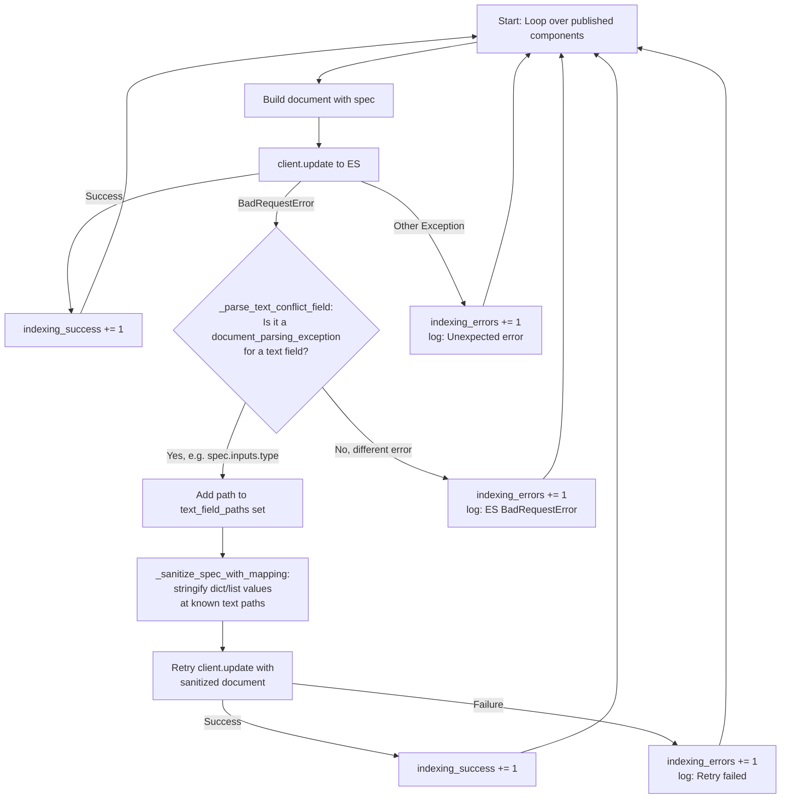

# Indexing Sanitization Flow

When Elasticsearch has dynamically mapped a field as `text` but a subsequent document sends a dict/list for that field, a `document_parsing_exception` is thrown. The indexing loop catches this and retries with the value stringified.

## Key Points

- **No pre-sanitization** -- the raw spec goes straight to ES
- **Single sanitization point** -- only inside the `except BadRequestError` path
- `text_field_paths` accumulates across the loop, so if `spec.inputs.type` conflicts on doc B, it's in the set for docs C and D -- but they still go through the same error → sanitize → retry flow (no shortcut)
