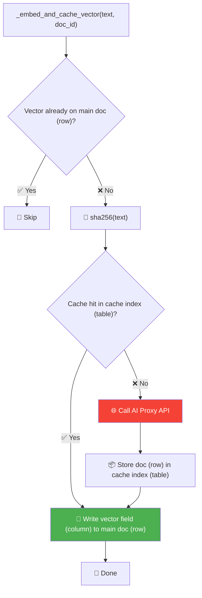
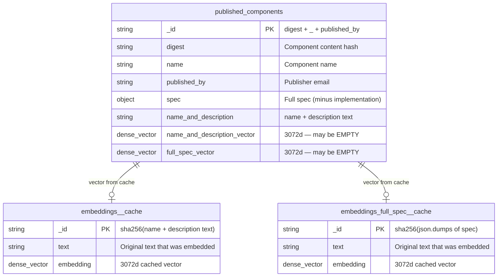

# 🗄️ Component Indexing & Embedding Design

## Table of Contents

- [Elasticsearch → SQL terminology](#elasticsearch--sql-terminology)
- [TL;DR](#-tldr)
- [Trigger API](#-trigger-api)
- [ES Indices (tables)](#️-es-indices-tables)
  - [Main Document (row) Shape](#main-document-row-shape)
  - [Cache Document (row) Shape](#cache-document-row-shape)
- [Embedding Vectors](#-embedding-vectors)
- [Cache Flow](#-cache-flow--_embed_and_cache_vector)
- [Cache Scenarios](#-cache-scenarios)
- [Appendix: Step-by-Step Walkthrough](#appendix-step-by-step-walkthrough)
  - [Index (table) ER Diagram](#index-table-er-diagram)
  - [Step 1: Upsert text fields](#step-1-upsert-text-fields-columns-to-main-index-table)
  - [Step 2: Check if vector exists](#step-2-embed-namedescription--check-if-vector-exists)
  - [Step 3: Check cache](#step-3-embed-namedescription--check-cache)
  - [Step 4: Call AI Proxy + write cache](#step-4-embed-namedescription--call-ai-proxy--write-cache)
  - [Step 5: Write vector to main doc](#step-5-write-namedescription-vector-to-main-doc-row)
  - [Step 6: Embed full spec](#step-6-embed-full-spec--same-flow-repeats)
  - [Final state](#final-state--all-three-indices-tables)
  - [Re-indexing (unchanged)](#re-indexing-the-same-component-unchanged)

---

## Elasticsearch → SQL terminology

| Elasticsearch | SQL equivalent |
|---------------|----------------|
| Index | Table |
| Document (doc) | Row |
| Field | Column |
| `_id` | Primary key |

## 📍 TL;DR

| | Text Fields (columns) | Embedding Vectors |
|--|-------------|-------------------|
| **Cached?** | ❌ No — always upserted | ✅ Yes — `sha256(text)` → separate ES cache index (table) |
| **Why?** | Cheap ES write | Embedding API (AI Proxy) calls are expensive + slow |

---

## 🚀 Trigger API

```
POST /api/admin/elasticsearch/index_published_components?es_use_embeddings=true
```

| `es_use_embeddings` | Text indexing | Vectors + Cache | Embedding API (AI Proxy) |
|---------------------|---------------|-----------------|---------------|
| `false` (default) | ✅ | ❌ | ❌ |
| `true` | ✅ | ✅ | ✅ on cache miss |

---

## 🏗️ ES Indices (tables)

| Index (table) | Purpose | Doc `_id` (primary key) |
|---------------|---------|-------------------------|
| `published_components` | Main search index (table) | `{digest}_{published_by}` |
| `embeddings__openai_...__3072` | Cache: name+description embeddings | `sha256(text)` |
| `embeddings_full_spec__openai_...__3072` | Cache: full spec embeddings | `sha256(text)` |

### Main Document (row) Shape

| Field (column) | Type |
|----------------|------|
| `digest`, `name`, `published_by` | `text` |
| `spec` | `object` (minus `implementation` + noisy annotations) |
| `name_and_description` | `text` (stored for reference) |
| `name_and_description_vector__openai_...` | `dense_vector` (3072d) |
| `full_spec_vector__openai_...` | `dense_vector` (3072d) |

### Cache Document (row) Shape

| Field (column) | Type |
|----------------|------|
| `text` | original text that was embedded |
| `embedding` | `dense_vector` (3072d) |

---

## 🧠 Embedding Vectors

| # | Vector | Text Source | Cache Index (table) |
|---|--------|------------|---------------------|
| 1 | `name_and_description_vector` | `name` + `\n\n` + `description` | `embeddings__openai_...` |
| 2 | `full_spec_vector` | `json.dumps(spec)` | `embeddings_full_spec__openai_...` |

---

## 💾 Cache Flow — `_embed_and_cache_vector()`



> ⚡ Cache `_id` (primary key) = `sha256(text content)`, not the component ID. Two components with identical text share one cached embedding.

---

## 🧪 Cache Scenarios

| Scenario | API (AI Proxy) Call? |
|----------|----------------------|
| 🆕 First-time index | ✅ Yes |
| 🔁 Re-index (unchanged) | ❌ No (vector field exists on doc → skip) |
| ✏️ Text changed | ✅ Yes (new hash = new `_id`) |
| 👯 Same text, different component | ❌ No (shared cache doc) |
| 🧹 Cache index deleted + re-index | ✅ Yes (re-embeds all) |

---

## Appendix: Step-by-Step Walkthrough

A concrete example indexing a component called **"Train Model"** (digest=`abc123`, published_by=`google`) with `es_use_embeddings=true`.

### Index (table) ER Diagram

In our system, there are **three** indices (tables):



**Index (table) descriptions:**

- **Index 1** `published_components` — the main search index. One doc (row) per published component.
- **Index 2** `embeddings__openai_...__3072` — cache for name+description embeddings.
- **Index 3** `embeddings_full_spec__openai_...__3072` — cache for full spec embeddings.
- Indices 2 and 3 are purely caches to avoid calling OpenAI repeatedly.

---

### Step 1: Upsert text fields (columns) to main index (table)

```json
// published_components (index/table) / _id (primary key): "abc123_google"
{
  "digest": "abc123",
  "name": "Train Model",
  "published_by": "google",
  "spec": { "name": "Train Model", "description": "Trains a ML model", "inputs": [...], "outputs": [...] }
  // vector fields (columns) don't exist on the doc (row) yet — added later by _embed_and_cache_vector()
}
```

| Index (table) | Docs (rows) |
|---------------|-------------|
| `published_components` | 1 doc (row) — text fields (columns) only, **no vectors yet** |
| `embeddings__openai_...__3072` | empty |
| `embeddings_full_spec__openai_...__3072` | empty |

---

### Step 2: Embed name+description — check if vector exists

Read the main doc (row), check if the field (column) `name_and_description_vector__openai_...` has a value.

- ✅ **Already has value** → skip everything (fast path for re-indexing)
- ❌ **Missing/null** → continue

For first-time indexing, it's missing. Continue.

---

### Step 3: Embed name+description — check cache

```
text = "Train Model\n\nTrains a ML model"
cache_key = sha256(text) → "a1b2c3..."
```

Look up `_id` (primary key) = `"a1b2c3..."` in cache index (table) `embeddings__openai_...__3072`.

- ✅ **Cache hit** → grab `embedding` field (column) from cache doc (row), skip to Step 5
- ❌ **Cache miss** → continue

First time, so cache miss. Continue.

---

### Step 4: Embed name+description — call AI Proxy + write cache

Call AI Proxy → get back 3072 floats.

Write to cache index (table):

```json
// embeddings__openai_...__3072 (index/table) / _id (primary key): "a1b2c3..."
{
  "text": "Train Model\n\nTrains a ML model",
  "embedding": [0.12, -0.34, 0.56, ...]
}
```

| Index (table) | Docs (rows) |
|---------------|-------------|
| `published_components` | 1 doc (row) — text only, still no vectors |
| `embeddings__openai_...__3072` | **1 doc (row)** — cached name+desc embedding |
| `embeddings_full_spec__openai_...__3072` | empty |

---

### Step 5: Write name+description vector to main doc (row)

```json
// published_components (index/table) / _id (primary key): "abc123_google" (updated)
{
  "digest": "abc123",
  "name": "Train Model",
  "published_by": "google",
  "spec": { "..." },
  "name_and_description": "Train Model\n\nTrains a ML model",
  "name_and_description_vector__openai_...": [0.12, -0.34, 0.56, ...]
}
```

| Index (table) | Docs (rows) |
|---------------|-------------|
| `published_components` | 1 doc (row) — text + **1 vector** |
| `embeddings__openai_...__3072` | 1 doc (row) |
| `embeddings_full_spec__openai_...__3072` | empty |

---

### Step 6: Embed full spec — same flow repeats

```
text = json.dumps(spec)  →  '{"name": "Train Model", "description": "Trains a ML model", ...}'
cache_key = sha256(text) → "f6e5d4..."
```

Same checks: vector on doc (row)? → **No**. Cache hit? → **No**. Call AI Proxy → get 3072 floats.

Write to cache:

```json
// embeddings_full_spec__openai_...__3072 (index/table) / _id (primary key): "f6e5d4..."
{
  "text": "{\"name\": \"Train Model\", ...}",
  "embedding": [0.78, 0.91, -0.23, ...]
}
```

Write vector to main doc (row):

```json
// published_components (index/table) / _id (primary key): "abc123_google" (final state)
{
  "digest": "abc123",
  "name": "Train Model",
  "published_by": "google",
  "spec": { "..." },
  "name_and_description": "Train Model\n\nTrains a ML model",
  "name_and_description_vector__openai_...": [0.12, -0.34, 0.56, ...],
  "full_spec_vector__openai_...": [0.78, 0.91, -0.23, ...]
}
```

### Final state — all three indices (tables)

| Index (table) | Doc `_id` (primary key) | Contents |
|---------------|-------------------------|----------|
| `published_components` | `abc123_google` | text fields (columns) + 2 vectors |
| `embeddings__openai_...__3072` | `a1b2c3...` | cached name+desc embedding |
| `embeddings_full_spec__openai_...__3072` | `f6e5d4...` | cached full spec embedding |

**Total AI Proxy calls: 2** (one per vector type, first time only)

---

### Re-indexing the same component (unchanged)

Steps 2 and 6 both find **vector already on doc (row) → skip**.

**Total AI Proxy calls: 0.** No cache lookups. No sha256.
