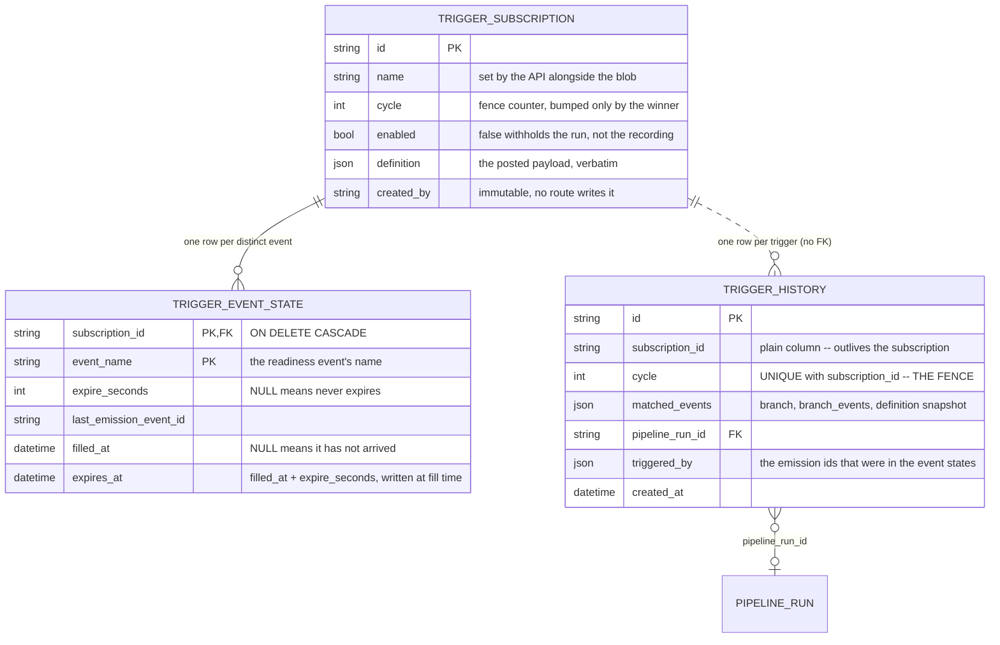

# Trigger architecture

How a readiness emission ends up starting a pipeline run. A **trigger subscription** says
"when these events have all arrived, start this pipeline". Emissions are the transport
([EMISSION_ARCHITECTURE.md](../../emissions/docs/EMISSION_ARCHITECTURE.md)); triggering is a
consumer of that transport.

This document describes the schema — the three tables, the fence that makes triggering
idempotent, the cycle counter that drives it, the one-transaction rule every write path
obeys — and now the evaluator that decides whether a condition holds, what an edit does to a
subscription's event state, and who may edit one at all. The sink that turns an arriving
emission into a filled event state, and the route layer above it, are separate modules; each
lands with its own PR and extends this document.

## Contents

- [The three tables](#the-three-tables)
- [The cycle, and the fence that uses it](#the-cycle-and-the-fence-that-uses-it)
- [The one-transaction rule](#the-one-transaction-rule)
- [Where state lives, and where it does not](#where-state-lives-and-where-it-does-not)
- [Freshness without a sweeper](#freshness-without-a-sweeper)
- [The definition blob](#the-definition-blob)
- [Evaluating a condition](#evaluating-a-condition)
- [What an edit does](#what-an-edit-does)
- [Who created it, and who may change it](#who-created-it-and-who-may-change-it)
- [The name is a natural key](#the-name-is-a-natural-key)
- [Deleting a subscription](#deleting-a-subscription)
- [Observability](#observability)

## The three tables



| Table | Holds | Mutable? |
| --- | --- | --- |
| `trigger_subscription` | What to start, whether it is live, the fence counter | Only on an edit |
| `trigger_event_state` | Which subscribed events have arrived, and whether they are still fresh | **Yes** — the only mutable table |
| `trigger_history` | One row per trigger, and the fence itself | Append-only |

## The cycle, and the fence that uses it

A subscription's `cycle` is a counter, not a timestamp. It names the current *round* of
waiting: cycle 0 is the first trigger, cycle 1 the next, and so on. A trigger writes a
`trigger_history` row stamped with the cycle it triggered for, and `UNIQUE (subscription_id,
cycle)` means that row can exist **once**.

That is what makes triggering idempotent at the database level rather than by convention:

```
Two writers both see "every event has arrived" for cycle 7
        │
        ├── writer A: INSERT trigger_history (sub-1, cycle 7)  ──►  committed, run started
        │
        └── writer B: INSERT trigger_history (sub-1, cycle 7)  ──►  IntegrityError
                                                                    no run started
```

The winner then bumps `trigger_subscription.cycle` to 8 and clears every event state, which
opens the next slot. The loser's whole transaction rolls back, so the run it was about to
start never happens — not "happens and is cleaned up".

A check-then-insert would leave a window between the check and the insert; the constraint has
no window. This is why the fence is a `UniqueConstraint` and not an index or a query.

The lock discipline around that insert is a separate question, and it belongs with the trigger
path rather than the schema: on MySQL, two transactions inserting the same unique key take
locks on it, and the losing one holds them until it rolls back. Whether the trigger path takes
the subscription row with `SELECT ... FOR UPDATE` first, and how it retries a deadlock, is
decided and documented with the sink.

## The one-transaction rule

Every write path is one transaction. Nothing here is eventually consistent.

| Path | Touches | Why one transaction |
| --- | --- | --- |
| Create or edit a subscription | `trigger_subscription`, plus a sync of `trigger_event_state` | An edit that adds an event must not leave the subscription waiting on an event with no state row |
| An emission arrives | one `trigger_event_state` row | Trivially atomic |
| The condition completes | `trigger_history` insert (the fence), `trigger_subscription.cycle`, every `trigger_event_state` cleared, and the `pipeline_run` | The fence is only a fence if the run and the row that claims it commit together |

The last row is the load-bearing one, and it is the reason this design needed a change
upstream. If the run were created in its own transaction, a crash between the two would
either start a run no history row claims — a double-trigger on the next attempt — or write a
fence row for a run that does not exist. So the run is created **inside the caller's
transaction**, through a private entry point on the upstream pipeline-run service rather than
its public `create()`, which owns a transaction of its own. The trigger path that uses it lands
with the sink; this table is the contract it is written against.

## Where state lives, and where it does not

State is in `trigger_event_state`, **once per event**:

```
condition: all[ any[ dataset-ready, dataset-ready-eu ], model-ready ]
                     └── named twice? still ONE row ──┘

trigger_event_state
  (sub-1, dataset-ready)     filled_at = 09:04   ← one arrival updates one row
  (sub-1, dataset-ready-eu)  filled_at = NULL
  (sub-1, model-ready)       filled_at = 09:11
```

The condition itself holds no state. It is a pure function of that table, walked in Python at
read time, so there is nothing to keep in step and nothing to migrate when a condition is
edited. An earlier design compiled the condition into rows of a fourth table; that table, its
index and its join are gone, and with them the recompile that corrupted history every time
someone edited a condition.

## Freshness without a sweeper

`expires_at` is computed once, at fill time, as `filled_at + expire_seconds`. Freshness is then
one SQL parameter:

```sql
expires_at IS NULL OR expires_at > :now
```

No interval arithmetic per row, no index on a computed expression, and **no sweeper job** —
a stale row simply stops counting toward the condition. `NULL` in either column means the
event never expires.

## The definition blob

A subscription is stored exactly as the API received it, in one `definition` column:

```json
{
  "name": "nightly-retrain",
  "condition": {"op": "all", "children": [{"event": "dataset-ready"}]}
}
```

Verbatim, and never rewritten — so an edit round-trips, a key this version does not know
about survives, and the payload shape can grow without a migration.

**Argument templates *are* in here**, under a third key beside `name` and `condition`:

```json
{
  "name": "nightly-retrain",
  "condition": {"op": "all", "children": [{"event": "dataset-ready"}]},
  "pipeline_templates": {"arguments": {"as_of_date": "{{ trigger_time | date }}"}}
}
```

Which is why "verbatim, never rewritten" is load-bearing for them too: a `PATCH` rebuilds the
blob and assigns it, since assigning is what tells SQLAlchemy the JSON changed, and empty
updates drop the key rather than storing `{}` (`utils/pipeline_templates.py:34`). What may be
written inside it is [TRIGGER_USAGE.md](../TRIGGER_USAGE.md#argument-templates).

**The target is not in here.** A definition says *when*; *what* it starts lives in two columns
beside it, `pipeline_task_spec_from_user_pipeline_id` and
`pipeline_task_spec_from_user_pipeline_version_key` (NULL = track the pipeline's current
version). Columns rather than JSON because the pair is a composite foreign key into
`user_pipeline_version`, which is what stops a subscription pointing at a version that does
not exist.

### Validation lives in the API, not in the model

Nothing in `db_models.py` validates a definition. That is deliberate, and it is a reversal:
an earlier draft of this schema validated on assignment (`@orm.validates`) and again at flush
(a `before_flush` listener), so that a definition could not reach the table unchecked however
it was written. Both are gone.

The reason is that there is exactly one writer. Every definition arrives through the API,
whose request model validates the payload before anything is assigned — the same place the
rest of this service validates (`scheduling/pipelines/api_routes.py` does it this way, and
nothing in the repo raises a validation error from inside a flush). A rejection there is a
422 naming the offending field. A rejection from a flush surfaces at commit time, far from
the line that caused it, and leaves the session needing a rollback.

The one flush-time rejection that stayed is the natural key on `(created_by, name)`, and it
stayed because it is not validation: uniqueness is a fact about the other rows in the table,
which no request model can see. It is handled the way this section argues for rather than
against — the service flushes at the point of the write and translates the failure there, so
it never reaches the route as a bare `IntegrityError` at commit. See
[The name is a natural key](#the-name-is-a-natural-key).

The one thing a flush-time check caught that a request model cannot is an **in-place** edit
of the stored dict:

```
   route ──> request model ──> sub.definition = {whole new dict}     checked
   anything else ─────────────> sub.definition["condition"] = ...    unchecked
```

That second path is not a path this design has. An update replaces the whole blob, and
SQLAlchemy writes it as one value — `SET definition=?` with the entire document, never a
partial JSON update — so "validate the payload, then assign it" leaves nothing behind.

### `name` is a plain column the API keeps in step

`name` is a real column as well as a key in the blob, so listing and filtering read a column
instead of extracting JSON — which MySQL evaluates per row and cannot serve from an index.
The column is not indexed yet: the listing route lands with the API, and the index belongs
with the query it serves.

It is a copy, and the API is what keeps a copy honest: the write path validates the payload
and then sets the column and the blob together, in the same call. Two lines, in one function,
that a reviewer can check by reading it — rather than a model-level hook that has to be
correct for every write in the process.

## Evaluating a condition

A condition is the tree the caller posted, read straight out of `definition["condition"]`.
Nothing is compiled and nothing is cached: a branch is `{"op": "all"|"any", "children": [...]}`
and a leaf names one event, `{"event": "dataset-ready"}`, optionally carrying that event's
`expire_seconds`.

```
      SQL                                    Python
      ───                                    ──────
  which events have arrived?             does the condition hold?

  SELECT event_name, last_emission_event_id      all ─┬─ any ─┬─ orders-us-ready
    FROM trigger_event_state                         │        └─ orders-eu-ready   ← emitted
   WHERE subscription_id = :sid                      ├─ refunds-ready              ← emitted
     AND filled_at IS NOT NULL                       └─ any ─┬─ fx-primary-ready
     AND (expires_at IS NULL                                 └─ fx-backup-ready    ← emitted
          OR expires_at > :now)
                                              satisfied, and the match says why
```

The database answers only what it is good at. One table, no join, no aggregate: a prefix seek
on the primary key `(subscription_id, event_name)`, with freshness decided by the single `:now`
parameter. The tree is then walked against that set in memory, so nesting costs a stack frame
and nothing else — there is no term table to keep in step and no depth limit to hit.

The walk returns a **match** rather than a boolean, and `satisfied()` is that same walk
asking whether one exists. A history row therefore records not just *that* the condition held
but where:

```
branch         "all[0].any[1]"                    each segment is operator[index] against
                                                  the JSON the caller posted
branch_events  ["orders-eu-ready", "refunds-ready", "fx-backup-ready"]
                                                  an `any` contributes only the child it
                                                  chose, so this is what the trigger needed
definition     the whole payload, deep-copied     stays readable after an edit, or after the
                                                  subscription is deleted
```

**A malformed node raises, naming the node.** Returning "not satisfied" would strand a live
subscription; returning an empty event set would make the sync below delete every event
row it has. Neither failure announces itself, so neither is allowed.

## What an edit does

An edit is a sync, not a rebuild. The events the new condition names are diffed against
the rows already there:

```
any(A, B)  ──►  any(A, C)

  A   in both    row untouched — filled_at, its emission id and its expiry all survive
  B   removed    row deleted, its state going with it
  C   added      row inserted empty, never seen
```

An identical edit is therefore a no-op by construction — both sides of the diff are empty, so
not one `INSERT` or `DELETE` is emitted. No fingerprint column is needed to detect it, because
there is nothing a fingerprint would have prevented.

The order inside the request is load-bearing:

```
BEGIN
  1. sync trigger_event_state             delete gone · insert new · survivors untouched
  2. store definition and name
  3. SELECT the emitted events            after 1 and 2, so it sees the edit
  4. does the new condition hold?  ── yes ──► fence · clear · cycle++ · start the run
COMMIT                                          (one transaction: a failure at any step
                                                 takes the fence with it)
```

The condition is judged against the state the edit *leaves*, never the state it found. That is
what makes an edit able to trigger: `all(A, B)` with only `A` filled becomes `all(A)`, which is
satisfied the instant it is stored. Waiting for an unrelated emission instead would leave a
pipeline that should have started sitting idle for an unbounded time — so **a configuration
call can start a run**, deliberately.

An expiry change is a real change even though the event set is identical. `expires_at` is
recomputed from the surviving `filled_at`, in both directions:

| Edit to a filled event's expiry | `expires_at` | Can it trigger? |
|---|---|---|
| lengthened | moves later | ✅ an event that had lapsed comes back |
| shortened | moves earlier, possibly into the past | ❌ it can only un-satisfy |
| removed | `NULL` — never expires | ✅ |
| set on an event that never arrived | stays `NULL` until it fills | no change |

The revival is deliberate: the emission genuinely arrived, and whoever extended the window has
just said arrivals are valid for that long. Leaving `expires_at` alone would make an expiry
edit look like it had done nothing at all.

### Which edits re-evaluate

| Edit | Re-evaluates? | Why |
|---|---|---|
| Condition changed | ✅ | It can be satisfied by the edit itself |
| `enabled` off → on | ✅ | A condition satisfied while switched off has no emission left to prompt it |
| **Target or pin changed** | ✅ | **Reversal — see below** |
| Rename | ❌ | Cannot change whether the condition holds |
| Resending the stored condition, target or pin | ❌ | Compared by value, so a no-op PATCH is inert |
| `enabled` on → off | ❌ | Freezes the event states; it can only un-satisfy |

**The target reversal.** A target edit used to be inert on the same reasoning as a rename: a
pin changes *what* a satisfied condition launches, never *whether* it is satisfied. That
reasoning is sound and the conclusion was still wrong, because of what happens when the target
is deleted out from under a live subscription:

```
  emission arrives ──► condition holds ──► target pipeline is soft-deleted
                              │
            ┌─────────────────┴──────────────────┐
            │ savepoint rolls back:              │      arrival COMMITS
            │   trigger_history   ✗              │      condition still satisfied
            │   pipeline_run      ✗              │      cycle unchanged
            │   event_state.clear ✗ (not reached)│      emission settled FAIL,
            │   cycle++           ✗ (not reached)│      no redelivery
            └────────────────────────────────────┘
                              │
            PATCH the target to a live pipeline ──► re-evaluate ──► run starts
```

Without the re-evaluation that last arrow does not exist and the subscription is stranded for
good. It cannot double-fire: a *successful* trigger clears the event states in the same
transaction that claims the cycle, so a target edit only ever finds a satisfied condition when
that condition was genuinely never consumed.

Triggering goes through one path, whether the news arrives as an emission or as an edit — the same
fence, the same clearing, the same cycle bump. An edit is not a second way to start a run; it
is a second way to notice that the condition holds. If two writers notice at once, the loser's
`trigger_history` insert collides on `(subscription_id, cycle)`; it sits in its own SAVEPOINT,
so that one row rolls back and the loser's own work — a synced event set — still commits,
reporting that the cycle was already triggered.

### The fence and the run are one write

That SAVEPOINT holds the run too. `trigger_history` is inserted and flushed, then the run is
built from the subscription's target inside the same nested block, and only then does
`trigger_history.pipeline_run_id` get set:

```
  SAVEPOINT
    INSERT trigger_history          the fence: UNIQUE (subscription_id, cycle)
    FLUSH                           a collision here is the lost race, nothing else
    build the run                   pipeline_run + execution_node + artifact_node
    history.pipeline_run_id = run.id
  RELEASE
  clear event states · cycle++
```

So there is no cycle claimed against a run that does not exist, and no run started against a
cycle nobody claimed. What leaves through that savepoint is a reason rather than an exception,
and the reasons mean different things:

| Failure | Reported as | Retryable? | Who repairs it |
|---|---|---|---|
| `IntegrityError` on the **fence flush** | `cycle_already_triggered` | No — the winner did the work | Nobody |
| Target pipeline deleted or pinned version gone | `user_pipeline_deleted` | No | The subscriber, by repointing it |
| Stored task spec no longer parses (`pydantic.ValidationError`) | `target_unbuildable` | No — every attempt reads the same JSON | The pipeline's owner, by re-saving it |
| A retryable write failure — deadlock, pool timeout, dropped connection | *re-raised* | **Yes** — the sink defers and retries the delivery | Nobody |
| Anything else the run build raises — including an `IntegrityError` from the run insert | `run_start_failed` | No, as far as we can tell | On-call, from the logged traceback |

The first and last rows are both `IntegrityError` raised inside the same savepoint, so the
fence's rejection is translated to `_FenceLost` at the raise site. Without that, a constraint
the *run* insert violated would report `cycle_already_triggered` — a reason deliberately
outside `RUN_NOT_STARTED_REASONS`, so the emission would settle a success with no run started.

Only the retryable row propagates, and it is caught above the catch-all on purpose: contained,
a lock conflict lasting milliseconds would be reported as a permanent failure on an emission
that is settled and never redelivered. The other three are contained because a raise out of
`_trigger` does not fail one subscription — it aborts the fan-out over every subscription
waiting on that event name and drops the readiness signal for all of them.

The three that mean "the arrival is committed and no run exists" are
`triggers.service.RUN_NOT_STARTED_REASONS`. Both places that split `failed` out of `outcomes` —
the fan-out and the sink's post-retry recompute — classify on that set, so a new permanent
reason cannot be known to one and not the other.

One raise out of the fan-out is not a failure at all. `record_event_and_maybe_start_runs`
takes an optional `deadline`, checked *between* subscriptions, and raises `FanOutIncomplete`
when it runs out with subscriptions left — stopping rather than reporting, because a report
settles the emission and the subscriptions not reached would never hear the signal. The
subscriptions already served committed one transaction each and are recognised on the way back
round by `last_emission_event_id`. `index > 0` on the check is the termination proof: every
pass serves at least one subscription, so a list of N is exhausted in at most N passes.

What the savepoint deliberately does **not** cover is the arrival, which was written into the
caller's transaction before any of this and commits either way. That is the whole basis of the
recovery path in [Which edits re-evaluate](#which-edits-re-evaluate).

## Who created it, and who may change it

`created_by` is `NOT NULL` and stamped server-side from the authenticated caller. No route
writes it again. That one column is the whole per-subscription permission model — there is no
role table and nothing else to grant. The only other tier is the one the application already
has: `ADMIN_USERS` (`app.py:213`), which sets `permissions["admin"]` on the caller.

```
POST   /api/triggers/subscriptions         any authenticated caller  201, created_by = caller
                                                                     409 on a duplicate name
GET    /api/triggers/subscriptions[/{id}]  any authenticated caller  200, read is open
PATCH  /api/triggers/subscriptions/{id}    created_by, or an admin   200, else 403
                                                                     409 on a duplicate name
DELETE /api/triggers/subscriptions/{id}    created_by, or an admin   204, else 403
```

The caller is resolved by `get_user_details` (`app.py:222`), which raises **401** when it
cannot name one. So `created_by` can never be empty, and it is never taken from the request
body — a payload carrying its own `created_by` is rejected rather than believed.

Read stays open on purpose: a subscription is a scheduling rule that a team needs to be able
to see and reason about — but "open to anyone authenticated" is not "open to anyone", and an
unnamed caller is a 401 on every route including the reads. Change is closed to the creator, so
there is no sequence of calls by which one ordinary caller acquires another's subscription.

Admins are the exception, and they exist for one failure creator-only cannot survive: when the
creator leaves, their subscriptions would otherwise be stranded — un-editable and un-deletable —
while still starting a run every cycle. That leaves exactly two things that authorize a write,
and a caller can write neither: a column the server stamps, and a list that ships with the
deploy. There is nothing to add yourself to, so the escalation path stays closed. The refusal
itself is raised by the service (`triggers/service.py`'s `NotAuthorized`) rather than by the
route, so a caller that is not an HTTP request — a backfill, a console script — is refused on
the same terms; the route only translates it to a 403.

## The name is a natural key

`UNIQUE (created_by, name)` — `uq_trigger_subscription_created_by_name`. `id` stays the
primary key and the foreign key target; the name is what a *caller* addresses a subscription
by, so a CI job can PATCH `nightly` without first persisting its own name-to-id map.

The scope is per creator, mirroring `uq_pipeline_user_id_file_path` in
`user_pipelines/db_models.py`. Two teams may both call something `nightly`, and neither can
squat the other's handle:

```
created_by   name
alice        nightly   ok
bob          nightly   ok  — same name, different creator
alice        weekly    ok  — same creator, different name
alice        nightly   REJECTED — both columns match row 1
```

UNIQUE is checked on `UPDATE` exactly as on `INSERT`, so there is no rename loophole: both
write paths that can set a name — `create_subscription` and `update_subscription`, whether the
edit carries a condition or only the new name — flush through `_flush_or_name_taken`, which
raises the domain error `NameTaken`. The route translates that to **409 Conflict**.

In `update_subscription` that flush is deliberately outside every `if`. It has a second job:
the sessions the service runs under are `autoflush=False`, so it is also what puts
`event_state.sync`'s writes on the wire before `maybe_trigger` reads them back. Gated on
`name`, a condition-only edit would evaluate against the state it found rather than the state
it left.

The collision is left to the database rather than pre-checked with a `SELECT`. A read-then-
write has a race between the two statements; the constraint does not.

### Why the message names the scope

```
409 Conflict
{
  "detail": "You already have a subscription named 'nightly'. Subscription names must be
             unique per creator; another user may still use this name."
}
```

A bare "name already exists" reads as *globally* taken, and the caller's next move is
`nightly-2` or a team prefix — which is exactly the id-to-name mapping the natural key exists
to spare them. Naming the scope is safe here by construction: the constraint includes
`created_by`, so a 409 from it is always about a row the caller already owns, and no other
user's data can leak through it.

### Equality is the database's, not ours

MySQL's `utf8mb4_0900_ai_ci` is case- and accent-insensitive, so in production `Nightly`
collides with `nightly` and `café` with `cafe`. SQLite's default `BINARY` collation is
neither, so a local run lets both through. A rename test that passes locally can therefore
409 in production. The collision check in `triggers/service.py` matches both dialects'
wording for this reason.

## Deleting a subscription

Deleting a subscription must not delete the record that it started runs.

```
DELETE trigger_subscription (sub-1)
   │
   ├──► trigger_event_state  (sub-1, *)   CASCADE — gone, they are only pending state
   │
   └──► trigger_history      (sub-1, *)   KEPT — runs really were started
```

`trigger_event_state.subscription_id` is a foreign key with `ON DELETE CASCADE`, so the
pending state goes with the subscription and no orphan can survive a delete that skipped the
application layer.

`trigger_history.subscription_id` is deliberately a **plain column with no foreign key**. An
enforced reference would either block the delete or null the column out, losing which
subscription triggered. The `matched_events` snapshot of the whole definition is what keeps such a
row readable once there is no subscription left to look up.

> On MySQL the cascade is enforced by the database. SQLite ignores foreign keys unless
> `PRAGMA foreign_keys=ON` is set per connection, and the shared engine factory does not set
> it — so the cascade tests use an engine that does, and assert the schema rather than the
> pragma.

## Observability

The failures this instrumentation exists for raise nothing. A subscription whose
`expire_seconds` is shorter than the real gap between its upstreams fills one event, lets it
lapse, fills the next, and never triggers — every delivery succeeds, every log line is
unremarkable, and no error is raised anywhere. A subscription whose target pipeline was
deleted is quieter still: it stops for good. The counters are where both show.

| Metric | Type | Labels | What it measures | What it answers |
|---|---|---|---|---|
| `trigger.triggered` | counter | `subscription_id` | Cycles claimed, counted after the fence insert wins | Is anything triggering at all? Flat while arrivals keep landing is the whole diagnosis below. |
| `trigger.event_filled` | counter | `subscription_id`, `event_name` | Arrivals written onto an event state | Are events landing where the subscription expects them? A name nobody produces never appears here. A redelivery is not counted — nothing was written. |
| `trigger.event_expired` | counter | `subscription_id`, `event_name` | Evaluations that found this event filled but lapsed | **The silent failure.** Climbing on a subscription whose `trigger.triggered` is flat is an expiry set shorter than the real arrival gap. |
| `trigger.run_not_started` | counter | `subscription_id`, `reason` | Conditions that held where the run could not be started anyway | **The permanent failure.** Any non-zero rate is a subscription that has stopped and will stay stopped until a human intervenes. Alert on it, then read `reason` — all three of `RUN_NOT_STARTED_REASONS` land here and each is repaired by a different person. |
| `trigger.cycle_collisions` | counter | `subscription_id` | Writers that saw the condition hold and lost the fence | Whether two writers are racing the same cycle. The loser writes nothing and reports a successful delivery, so this is its only trace. |
| `trigger.oldest_waiting_arrival_age` | observable gauge | `subscription_id` | Seconds since the oldest live arrival an enabled subscription has not triggered off | Which subscription is stuck part-satisfied, and for how long. It disappears when the subscription triggers, rather than falling to zero. Bounded by that subscription's `expire_seconds`: a lapsed arrival no longer holds the condition part-open and is not aged, so the reading sawtooths at the expiry rather than climbing without limit. |
| `trigger.staleness_poll_last_success_age` | observable gauge | — | Seconds since the poller behind the gauge above last completed a poll | Whether that gauge is still being computed. A failed poll keeps the last ages rather than clearing them, and the loop logs and carries on, so a broken poller looks healthy on every other series. Alert on this one. |

### Reading them together

| Symptom | Reading |
|---|---|
| `event_filled` climbing, `triggered` flat, `event_expired` flat | Genuinely still waiting. Ask the detail route what for. |
| `event_filled` climbing, `triggered` flat, `event_expired` climbing | Expiry too short for the gap between upstreams. Nothing will fix itself. |
| `event_filled` flat for one event name | Nobody is producing it, or it is spelled differently on the producing node's annotation. |
| `triggered` climbing and `cycle_collisions` with it | Two writers reaching the same condition; correct, but worth knowing the rate. |
| `run_not_started` non-zero on any subscription | The condition held and no run exists. Nothing retries and nothing else reports it — the emission is settled `FAIL`. `reason` says which and who fixes it: `user_pipeline_deleted`, the target is gone, so `PATCH` the subscription's `pipeline_id` at a live pipeline; `target_unbuildable`, the stored spec no longer parses, so the pipeline's owner re-saves it; `run_start_failed`, an unnamed failure in the run build, so read the logged traceback. In every case the arrival is still banked, so the fix is followed by the run starting. |
| `oldest_waiting_arrival_age` sawtoothing on one subscription | Same as the second row, seen from the other side, and it names the subscription. It cannot climb past `expire_seconds` — the arrival lapses and stops being aged — so `trigger.event_expired` is the series that indicts the expiry, and this one says whose. |
| `staleness_poll_last_success_age` climbing past a few poll intervals | The poller, not the triggers. Every waiting age is frozen at its last good reading and says nothing about now. |
| Everything flat, including `event_filled` | The emission side, not this one — start at `emissions/docs/EMISSION_OBSERVABILITY.md`. |

A disabled subscription is deliberately absent from the gauge. It keeps recording arrivals and
only withholds the run, so its oldest arrival ages for as long as it stays switched off — which
is the design, and would otherwise be the loudest thing on the dashboard.

### What is it waiting for

`GET /api/triggers/subscriptions/{id}` answers that without a SQL session: `live` is every event
whose arrival is still fresh, with the emission that filled it, and `missing` is what the
condition still wants. Both are computed from the same `event_state.events_emitted` read the
trigger decision uses, so the diagnostic and the verdict cannot disagree about which arrivals
count.

```
GET /api/triggers/subscriptions/sub-1

  "live":    {"orders_eu_ready": "em-7", "fx_backup_ready": "em-9"}
  "missing": ["fx_primary_ready", "orders_us_ready"]
```

Neither is stored. Freshness is a function of `now`, so an event that was `live` a minute ago
can be `missing` on the next read with nothing having written anything — see
[Freshness without a sweeper](#freshness-without-a-sweeper).

### Where each is recorded

| Instrument | Recorded in | Why there |
|---|---|---|
| `trigger.event_filled` | `service.record_event_and_maybe_start_runs`, inside the branch that wrote | Outside it, a redelivery would be counted as an arrival. |
| `trigger.event_expired` | `service.maybe_trigger`, only when the condition did not hold | Its extra read never sits on the path that starts a run. |
| `trigger.triggered` | `service._trigger`, after the fence insert wins | Counts runs decided on, not conditions that looked satisfied. |
| `trigger.cycle_collisions` | `service._trigger`, in the `IntegrityError` branch | The one place the loser is visible. |
| `trigger.run_not_started` | `service._trigger`, in each of the three permanent branches — `PipelineError`, `pydantic.ValidationError` and the `Exception` backstop — under that branch's own `reason` | One series per outcome, not per cause: all three settle `FAIL` with no redelivery, so a branch left uncounted would be a subscription stopped for good with nothing saying so. Both doors reach them — an arriving emission and a `PATCH` that re-evaluates — and each fails the same way through either. |
| `trigger.oldest_waiting_arrival_age` | `triggers/observability/staleness_poller.py`, from the metrics poller process | A gauge the sink emits cannot report the sink's own absence: no process, no observation, and the series goes stale rather than climbing. |
| `trigger.staleness_poll_last_success_age` | The same poller, from a monotonic clock seeded at construction | The poller that answers for everything else needs something answering for it. Read off a monotonic clock so a clock step cannot fake either freshness or staleness. |

Every count is *queued* at those points, not recorded there: `record_after_commit` parks it on
`Session.info`, and an `after_commit` listener records it once the write is durable. A counter
cannot be rolled back, and two callers would otherwise diverge from the ledger — the sink
retries a deadlock victim, so one eventual trigger would be counted once per attempt, and the
`PATCH` route commits after `update_subscription` has already decided. An outermost rollback
empties the queue; a SAVEPOINT rollback does not, which is what lets the fence lose its race
without discarding the arrival's own counts. Both listeners test `in_nested_transaction()`,
which is true only inside a SAVEPOINT: SQLAlchemy dispatches both events before it
deassociates the transaction, so `in_transaction()` cannot tell the two apart.

Recording itself goes through `trigger_metrics.increment`, which swallows its own failures — a
broken instrument must cost a log line and nothing else.

`trigger.event_expired` counts per evaluation that noticed, not per lapse. Expiry is a `WHERE`
clause on the read and nothing sweeps the row, so the lapse itself is not an event anything
could count — the number is a rate of noticing, and it climbs while the subscription keeps
receiving arrivals it cannot use.
