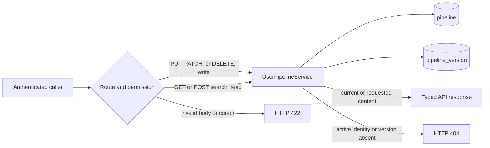
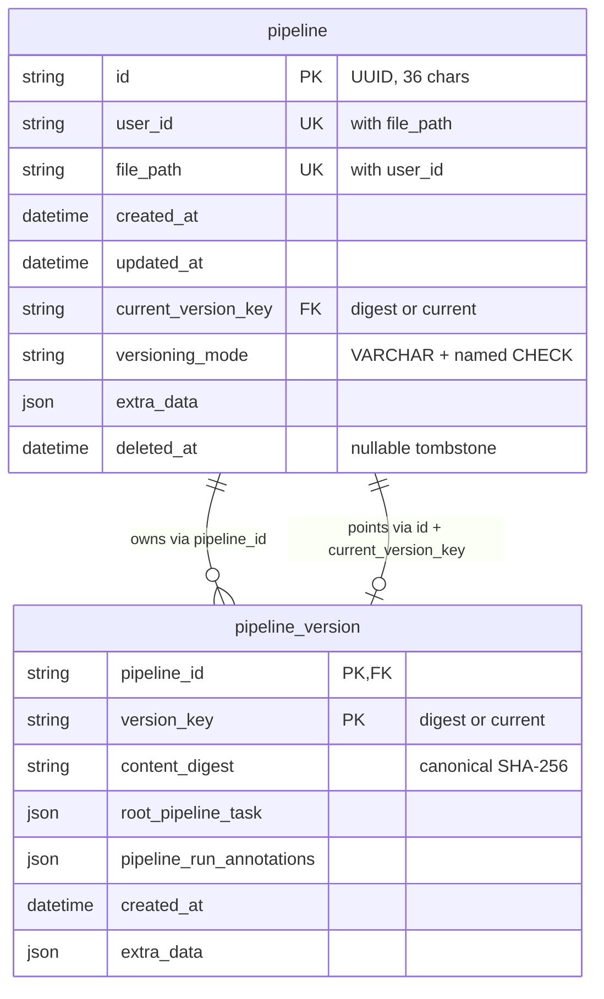
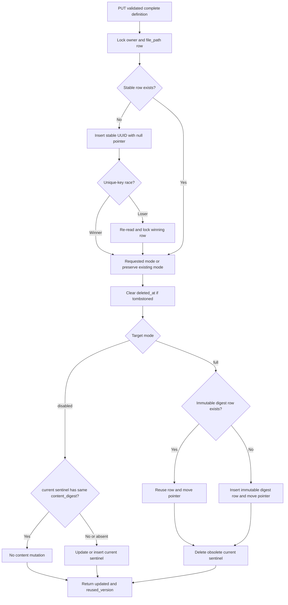
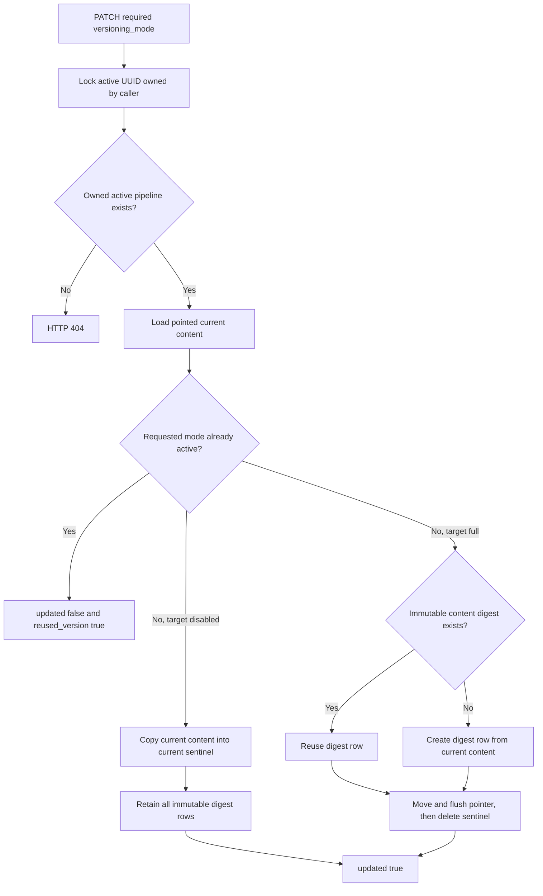
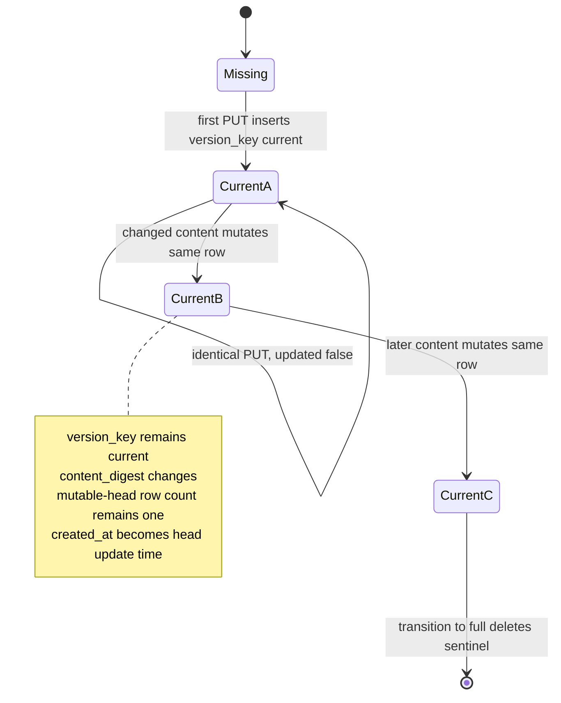
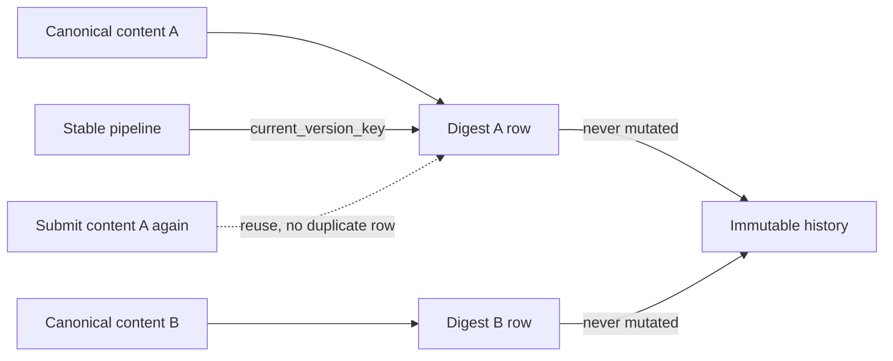
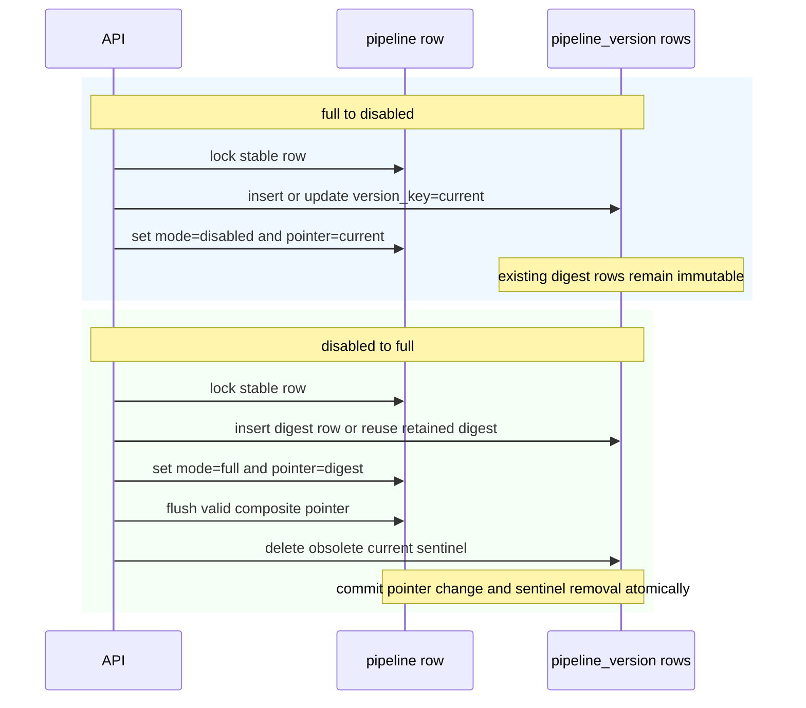
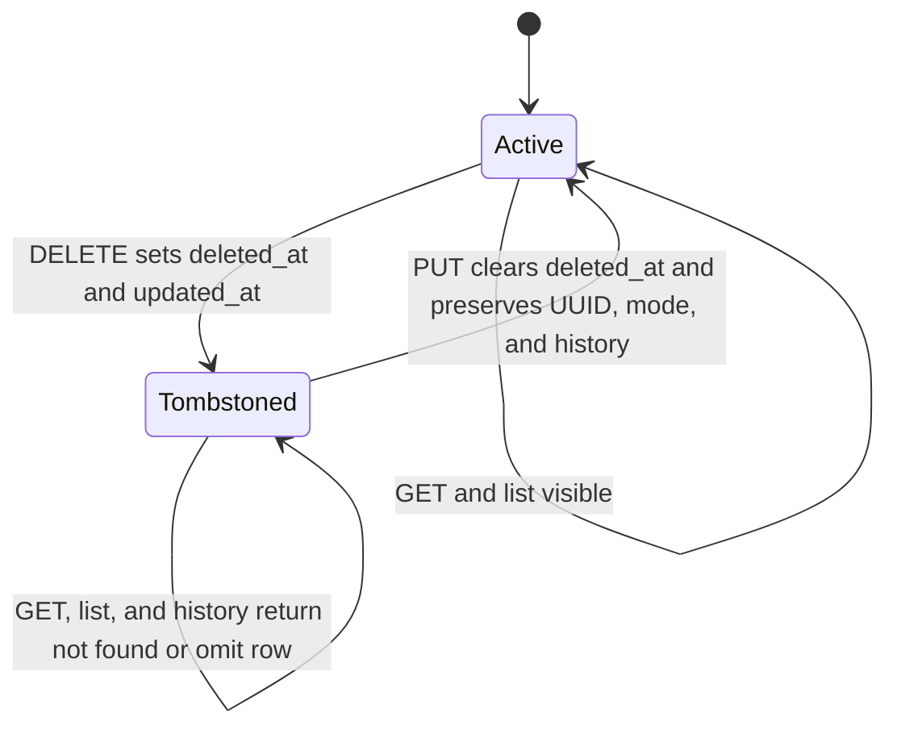
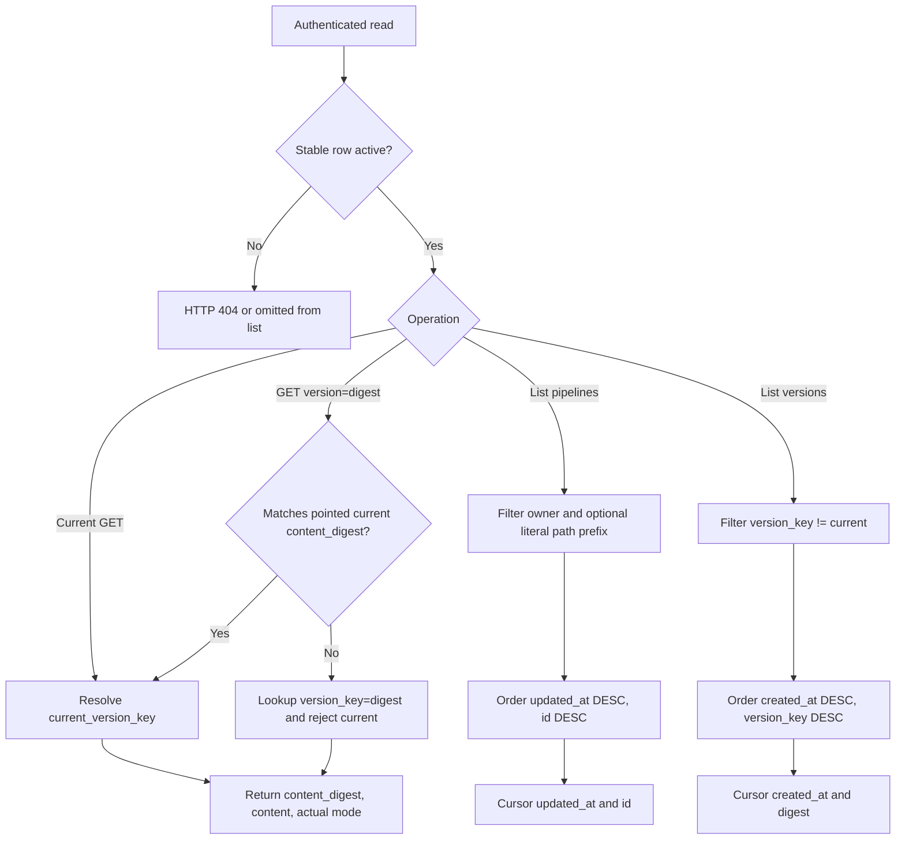

# User pipeline CRUD and versioning

The `cloud_pipelines_backend.user_pipelines` package stores pipeline definitions independently of pipeline runs. A saved pipeline has a stable UUID for one `(user_id, file_path)` identity, while its content is represented by one or more version rows. Saved definitions are authenticated resources, but they are **not a secret store**: any caller with `read` permission can use the public read endpoints.

Pipeline-run creation from a saved definition is intentionally outside this document. That API is implemented in a separate stacked change and is not part of this CRUD surface.

## API surface

| Method | Path | Permission | Meaning |
| --- | --- | --- | --- |
| `PUT` | `/api/users/me/pipelines?file_path=...` | `write` | Create, reactivate, or replace the complete definition of the caller's pipeline; it may also select a versioning mode. |
| `PATCH` | `/api/users/me/pipelines/{pipeline_id}/properties` | `write` | Change the versioning mode of an existing active pipeline owned by the caller without resubmitting its definition. |
| `DELETE` | `/api/users/me/pipelines?file_path=...` | `write` | Soft-delete the caller's pipeline. Repeated deletion is idempotent. |
| `GET` | `/api/users/me/pipelines?file_path=...&version=...` | `read` | Read the caller's current definition or an immutable digest version. |
| `GET` | `/api/users/me/pipelines/all?page_size=...&page_token=...&file_path=...` | `read` | List the caller's active pipelines; `file_path` is an optional literal prefix. |
| `POST` | `/api/pipelines/search` | `read` | Search active pipelines across owners, with filters, sorting, and pagination in a JSON body. Preferred search method. |
| `GET` | `/api/pipelines/search?filter_query=...&page_size=...&page_token=...` | `read` | Search using query parameters; URL length limits apply. Continue through POST for large tokens. |
| `GET` | `/api/pipelines?user_id=...&file_path=...&version=...` | `read` | Read by owner and file path. User IDs are query parameters, not URL segments. |
| `GET` | `/api/pipelines/{pipeline_id}?version=...` | `read` | Read by stable pipeline UUID. |
| `GET` | `/api/pipelines/{pipeline_id}/versions?page_size=...&page_token=...` | `read` | List immutable versions for an active pipeline. |

`version` is omitted to read current content. When supplied, it is a 64-character content digest. A digest equal to the pointed current row's `content_digest` aliases that authoritative current row; otherwise it identifies an immutable row by `version_key`. This makes the public `current_version` digest round-trip in both modes without exposing the disabled sentinel's storage key. Literal `version=current` remains invalid and returns 404.

A PUT is a complete-definition write. Its body contains required `root_pipeline_task`, optional `pipeline_run_annotations`, and optional `versioning_mode`. Omitting annotations on PUT canonicalizes them to `{}`; it does not preserve existing non-empty annotations. The two modes are:

- `disabled` (the default for a new pipeline): keep one mutable head and no new immutable history.
- `full`: retain immutable, digest-addressed content versions.

Omitting `versioning_mode` on an existing PUT preserves its current mode. PATCH accepts exactly the required `versioning_mode` property, so an empty body, unsupported value, or extra property fails request validation with HTTP 422. Stable-row `extra_data` is not part of this API. Responses always return the actual `versioning_mode`, and public `version` and `current_version` fields always contain a real content digest, never `current`.



## Searching saved pipelines

`POST /api/pipelines/search` requires `read` permission and searches across owners.
It returns one summary per active pipeline's pointed current version, including
pipelines that have never run. Historical versions and deleted pipelines are
excluded; both versioning modes are supported.

Send a JSON object containing any of `filter_query`, `page_size`, `page_token`,
`sort_field`, and `sort_direction`; `{}` uses the defaults. `filter_query` is a
JSON-encoded **string**, with the same grammar as the GET query parameter.
Unknown body fields return HTTP 422. Search does not require write permission.
GET remains available with the same parameters and response, but long names and
filters can produce tokens larger than a client or proxy permits in a URL.
Use POST for pagination, including when the first page came from GET.

The optional JSON `filter_query` uses run search's predicate models with a separate
SQL compiler. Its root is one nonempty `and` or `or` list; groups can be nested,
and `not` wraps a leaf predicate.

| Key | Predicates |
| --- | --- |
| `system/pipeline.id` | `key_exists`, `value_equals`, `value_in`; UUIDs are normalized. |
| `system/pipeline.user_id` | `key_exists`, `value_equals`, `value_in`; equality/inclusion accept `me`. |
| `system/pipeline.name`, `system/pipeline.file_path` | `key_exists`, `value_equals`, `value_in`, `value_contains`. |
| `system/pipeline.versioning_mode` | `key_exists`, `value_equals`, `value_in`; values are `disabled` or `full`. |
| `system/pipeline.date.created_at`, `system/pipeline.date.updated_at` | `time_range` with timezone-aware `start_time` and/or `end_time`; UTC, inclusive start, exclusive end. |
| Annotation key, e.g. `team` | `key_exists`, `value_equals`, `value_in`, `value_contains`. |

For example, pass this JSON as `filter_query` to find the caller's pipelines whose
current name contains `training` and whose saved `team` annotation is `research`:

```json
{
  "and": [
    {"value_equals": {"key": "system/pipeline.user_id", "value": "me"}},
    {"value_contains": {"key": "system/pipeline.name", "value_substring": "training"}},
    {"value_equals": {"key": "team", "value": "research"}}
  ]
}
```

Keys outside `system/` search the current saved version's pipeline annotations at
`root_pipeline_task.componentRef.spec.metadata.annotations`, matching the pipeline
editor. Use the literal annotation key, as in run search; no prefix is added.
These filters do not inspect historical versions, child component or task
annotations, saved `pipeline_run_annotations` defaults, or annotations on executions.
Stored annotation values are searched in full, without run search's 255-character
mirror limit. An empty string counts as an existing annotation.

Substring matching treats `%` and `_` literally and lowercases both operands
using the database's Unicode rules. Equality/inclusion follow database collation.
Missing names or annotation keys fail positive predicates and match their negations.

Invalid filters return HTTP 422. Unknown `system/` keys (including run keys) and
`time_range` on annotations are unsupported.
Limits: 16,384 characters, 16 JSON container levels, 100 leaves, 100 items per list.

### Sorting and pagination

| Parameter | Values | Default without a token |
| --- | --- | --- |
| `sort_field` | `name`, `updated_at` | `updated_at` |
| `sort_direction` | `asc`, `desc` | `desc` |
| `page_size` | 1–100 | 25 |

Sorting applies to all filtered matches before pagination. Date sorts on
`updated_at`; name sorts on the current saved `pipeline_name`, falling back to
the full `file_path` when the name is missing or empty. Names are lowercased by
the database before comparison; Unicode and accent ordering follow database
rules and may differ from a browser's locale ordering. ID breaks ties in the
same direction as the selected sort. The default remains `updated_at DESC, id DESC`.

For example, send `POST /api/pipelines/search` with this JSON body for the first
page in name order:

```json
{"sort_field": "name", "sort_direction": "asc", "page_size": 25}
```

Invalid sort fields or directions return HTTP 422.

Responses contain `pipelines`, `total_count` (all matches before pagination), and
`next_page_token`. Summaries contain `id`, `user_id`, `file_path`, `pipeline_name`,
`created_at`, `updated_at`, `current_version` (content digest), and `versioning_mode`;
queries filter annotations in SQL without returning their JSON or full task definitions.

Pass `next_page_token` as `page_token` in the next POST body to continue, for example
`{"page_token": "<next_page_token>", "page_size": 25}`. It retains the filter, caller,
sort field, and direction. Later requests may omit `filter_query` and either or
both sort parameters; omitted sorting is inherited independently from the token.
Resubmitted filters must match the parsed original, and explicit sort parameters
must match the token. Changing the filter, caller, or sorting requires a fresh
search; invalid or mismatched tokens return HTTP 422. Send a nondefault `page_size`
on each request; it may change between pages. The final page has a null token even
when it exactly fills the requested size.

The cursor seeks after the last `(sort value, id)` in the selected direction.
Duplicate names (including case variants), fallback names, and timestamp ties
therefore have deterministic page boundaries. Tokens retain the comparison value
from the returned row. New inserts ahead of it do not shift pages. Concurrent
edits/deletes can still change later results and counts; this is a live query,
not a snapshot. Every page checks read permission independently of its token.

For frontend integration, use POST and put search parameters in the JSON body.
Map Name to `name` and Date to `updated_at` (the local
list calls this `modified_at`). Include both sorting parameters in the query/cache
key, reset the page token when controls change, and append server-ordered pages
without sorting each page locally. Display `pipeline_name || file_path` to match
the name fallback. No new response fields are required.

Search lives in `cloud_pipelines_backend/user_pipelines/search`, taking a session and plain caller ID;
authentication stays in the injected route dependency. Search uses the existing
tables and indexes and requires no schema changes or startup migration.

Cross-owner searches, name sorting, and annotation filtering can scan rows and
require database sorting. An owner or pipeline-ID predicate can narrow that work.
Exact `total_count` is calculated on every page, so `page_size` does not bound
query cost. Additional performance optimizations should be based on measurements
of representative MySQL count and page queries.

## Persistence model and invariants



The stable row has primary key `pipeline.id` and unique key `(user_id, file_path)`. Its composite foreign key `(id, current_version_key)` references `(pipeline_version.pipeline_id, pipeline_version.version_key)`. This prevents a pipeline from pointing to another pipeline's version. Version rows also have an `ON DELETE CASCADE` owner foreign key for a future physical-retention cleanup; ordinary DELETE does not invoke it.

`versioning_mode` is a typed `PipelineVersioningMode` at the ORM boundary and stores lowercase values in a portable `VARCHAR(255)`, not a native database enum. The explicit SQLAlchemy enum configuration validates bound strings and creates the named `ck_pipeline_versioning_mode` CHECK constraint, so SQLite and MySQL-compatible schemas reject values outside `disabled` and `full`. These are canonical unshipped tables, so this schema is defined directly without a legacy migration.

`version_key` is the internal address of a row:

- In `full` mode it equals `content_digest`.
- The disabled mutable row alone has `version_key = "current"`.

`content_digest` is always the actual canonical SHA-256 digest and is the only digest exposed by the API. The stable pointer is `current` in disabled mode and the current digest in full mode.

The schema has these deliberate indexes:

- Unique `(user_id, file_path)` enforces stable identity and supports owner/path lookup and concurrent first-write reconciliation.
- `(user_id, updated_at DESC, id DESC)` supports deterministic active-pipeline listing for one owner. `id` is a stable tie-breaker.
- `(pipeline_id, created_at DESC, version_key DESC)` supports deterministic immutable-history pagination. `version_key` is the tie-breaker.

There is no prefix-plus-sort index: a range predicate on `file_path` cannot also provide the global `updated_at, id` ordering. The owner/path unique index still supports locating a prefix range, while the database performs the required ordering.

## Canonical content and digesting

The service validates `root_pipeline_task` recursively as a `TaskSpec` with unknown fields forbidden. Invalid definitions return HTTP 422 instead of being silently reduced to an older schema. The validated task is serialized through `TaskSpec.to_json_dict()`. This makes omitted fields and their explicit defaults canonical equivalents.

Annotations are typed as `dict[str, str]`. Omitted, `null`, and empty `pipeline_run_annotations` all canonicalize to `{}`. Keys under the global `system/*` namespace and the server-owned saved-pipeline provenance keys are rejected before digesting or opening the write transaction. This applies equally to creation, content replacement, mode-changing PUTs, and reactivation, so invalid annotations cannot create an identity or version or mutate a pointer, mode, timestamp, or tombstone. Non-empty valid annotations are digest-significant: changing only a meaningful annotation produces a distinct full-history version, while restoring the earlier annotation set reuses its existing digest row. The digest input is deterministic JSON containing:

1. the canonical TaskSpec dictionary; and
2. the canonical annotation dictionary.

The service computes that JSON once, hashes it with SHA-256, and stores the exact canonical dictionaries used by the hash. A matching digest therefore represents matching supported content.

## PUT definition-replacement behavior

PUT validates a complete definition, then locks the stable row, resolves the requested or preserved mode, canonicalizes content, then performs the mode-specific update within one transaction.



`updated` means durable stable/current state changed. It is true for creation, content change, mode change, movement to an older immutable version, or reactivation. It is false only when the submitted content is already current, active, and in the requested/preserved mode.

`reused_version` is independent:

- In full mode it is true when the immutable digest row already existed.
- In disabled mode it is true when the existing mutable head already had the same `content_digest`.

PUT is idempotent with respect to saved state: repeating an identical request does not create additional versions and reports `updated: false`. PUT itself still returns HTTP 200 for both changes and no-ops.

## PATCH property-update behavior

`PATCH /api/users/me/pipelines/{pipeline_id}/properties` changes only `versioning_mode`. It requires `write` permission and filters the locked stable row by both UUID and the authenticated caller's owner ID. It never creates a pipeline, writes another owner's pipeline, or reactivates a tombstone; missing, foreign, and deleted UUIDs all return HTTP 404.

PATCH loads the pointed current row and copies its already-canonical task, annotations, real `content_digest`, and derived version metadata through the same transition invariants. The caller neither sends nor replaces definition content.



A same-mode PATCH is a semantic no-op: it preserves `updated_at`, reports `updated: false`, and reports `reused_version: true` because the current representation is reused. Disabled-to-full reports whether it reused a retained immutable digest row; otherwise it creates one. Full-to-disabled normally creates the sentinel and reports `reused_version: false`. Both transitions preserve the public content digest, task, and annotations.

## Disabled mode: one mutable head



Disabled mode never creates an immutable row for ordinary content updates. The `current` row's task, annotations, digest, timestamp, and per-version metadata are updated in place. Public current reads return its `content_digest`, and supplying that digest as `version` explicitly aliases the pointed sentinel. The sentinel remains excluded from immutable-history rows, counts, and cursors, and literal `version=current` returns 404.

Immutable rows left by an earlier full-mode period remain retained and readable by digest while the pipeline is disabled. They are not marked current because current content is represented by the excluded sentinel.

## Full mode: immutable digest versions



In full mode each distinct canonical digest is inserted at most once per pipeline. Returning to historical content moves the stable pointer back to the existing digest row and reports `reused_version: true`. The immutable row is not rewritten, so its original `created_at` and content remain stable. Historical rows are ordered by `(created_at DESC, version_key DESC)`.

## Atomic mode transitions

Both directions preserve immutable history and update the pointer without violating the composite foreign key.



A mode change may also change content in the same request. Full-to-disabled writes the submitted content to the sentinel while retaining every immutable digest row. Disabled-to-full creates or reuses the submitted digest row, moves the pointer, flushes that valid relationship, then deletes the sentinel. If the digest survived from an earlier full-mode period, the transition reuses it rather than duplicating it.

## Soft deletion and reactivation



DELETE locks the stable row and sets `deleted_at` and `updated_at` to the same UTC timestamp. It retains the current pointer, mode, mutable sentinel if present, and all immutable history. Repeated DELETE returns HTTP 204 without changing the original tombstone timestamp. Deleting an identity that never existed returns 404.

A later PUT reactivates the same stable UUID and clears `deleted_at`. Omitted mode preserves the tombstoned row's mode. Content and mode then follow the normal PUT rules; retained immutable rows may be reused.

## Reads, histories, and pagination



Normal reads, counts, history, and lists exclude tombstoned pipelines. Current GET resolves the stable pointer and returns the pointed row's `content_digest`, regardless of mode. An explicit matching digest resolves that same pointed row before immutable lookup; any different digest resolves only by immutable `version_key`. This avoids ambiguity after full-to-disabled transitions, when the sentinel and a retained immutable row can share one `content_digest`, while still allowing a disabled pipeline's public current digest to round-trip even when its immutable-history list is empty.

Pipeline listing returns the current real digest and actual mode for each active row. It is ordered by `(updated_at DESC, id DESC)` and uses both values in an opaque page token. Version history excludes `current` in both the query and total count, orders by `(created_at DESC, version_key DESC)`, and uses the timestamp and digest in its token. `page_size` is constrained to 1 through 100. Invalid cursors return HTTP 422.

The optional list `file_path` filter uses an escaped literal prefix, so wildcard characters in a path are not treated as SQL pattern syntax. Counts use the same active/prefix filters as page retrieval.

## Transactions and race handling

Writes use a single SQLAlchemy transaction. Existing stable identities are selected with `FOR UPDATE`, serializing updates, mode changes, deletion, and reactivation for the same `(user_id, file_path)` where the database supports row locks.

Two first writers may both observe no row before either insert commits. The service attempts the stable insert inside a SAVEPOINT. The unique owner/path constraint chooses one stable UUID; after an expected conflict, the loser re-reads and locks the winning row. This is portable across supported SQL dialects and keeps the outer transaction usable.

Version inserts use the same SAVEPOINT helper. An integrity error is suppressed only if the exact expected `(pipeline_id, version_key)` row exists after re-read; otherwise the original error is re-raised. This avoids dialect-specific conflict clauses and does not hide unrelated foreign-key, check, or data-integrity failures.

The stable pointer, mode, content row, tombstone state, and transition cleanup commit together. Readers therefore cannot observe a committed pointer whose referenced version is missing.
